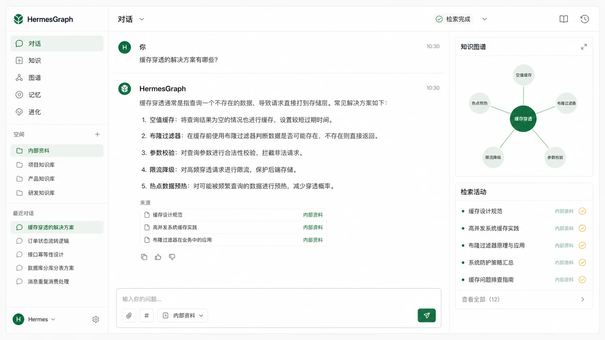
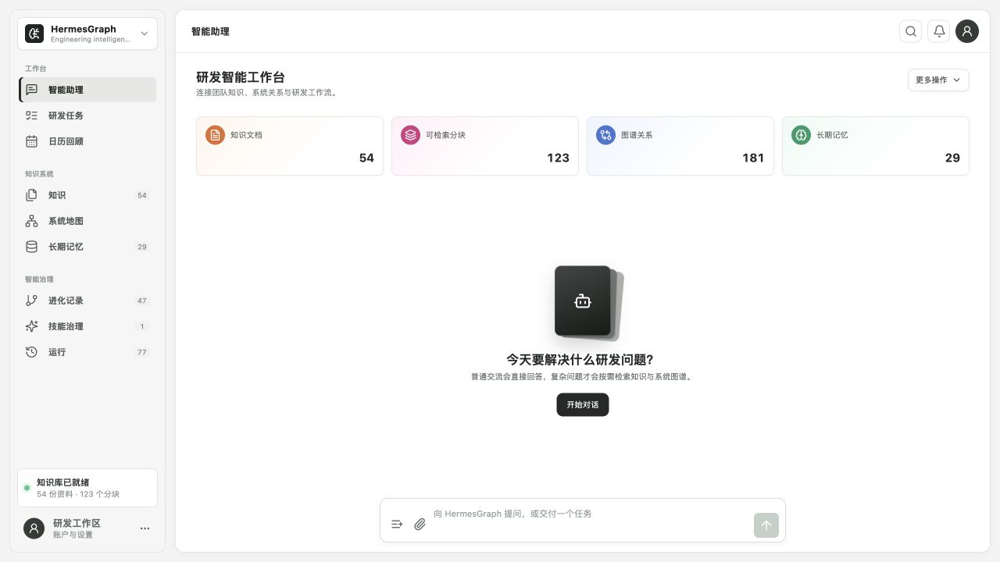
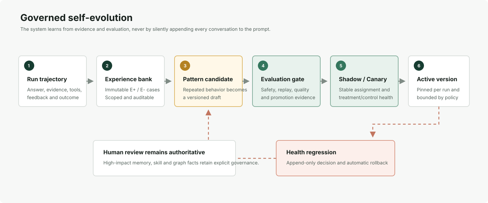
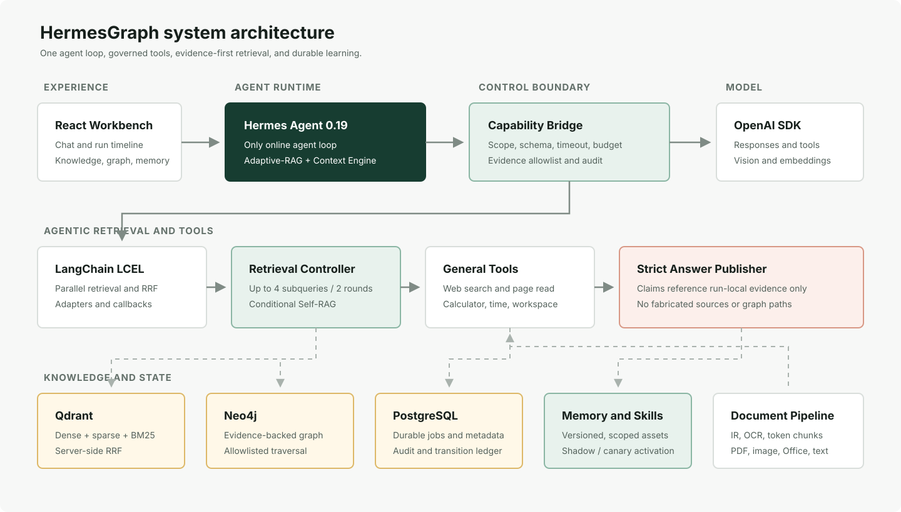

# HermesGraph

**面向研发团队的证据优先、自进化、多模态 Agentic RAG 系统。**

HermesGraph 将企业内部文档、代码资料、知识图谱、个人记忆和通用工具接入同一个 Agent 工作空间。
它既能直接处理普通对话，也能针对复杂研发问题自主规划检索、融合文本与图关系、检查证据充分性，
并把经过治理的成功经验沉淀为 Memory、Skill 和可回滚 Pattern。



> 上图是产品形态示意图。下方“实际界面”来自当前 Docker 工作台和真实本地数据。

## 为什么做 HermesGraph

传统 RAG 常把每个问题都交给一次向量检索，再将若干 chunk 塞给模型。研发场景往往更复杂：

- “你好”不应该启动一整条 RAG 链路；架构对比、事故影响分析才需要多步检索。
- 关键词与语义召回适合找原文，服务依赖、负责人、事故链和影响路径更适合图谱。
- 模型给出的引用必须来自本轮真实证据，不能自行生成来源或任意 Cypher。
- Agent 可以从经验中学习，但不能把每段对话都静默追加到 Prompt，更不能未经评测修改生产行为。
- 企业知识与个人资料需要共享同一能力内核，同时保持 tenant、project、user 和 session 隔离。

HermesGraph 因此采用 **Hermes-first Agent Loop + Adaptive-RAG + Hybrid Retrieval + Evidence Graph +
Governed Learning**。目标不是做一个只能问论文的 Demo，而是一个可以持续工作的研发知识同事。

## 实际界面



当前工作台包含智能助理、知识入库、系统地图、长期记忆、进化记录、Skill 治理、运行轨迹、研发任务
和日历回顾。截图中的 54 份知识文档、123 个可检索分块、181 条图关系、29 条长期记忆均来自当前
本地 Compose 环境，不是静态占位数据。

## 核心能力

### 1. Adaptive-RAG 与条件式 Self-RAG

每轮首先由轻量模型进行一次结构化路由，而不是使用关键词硬规则：

| 策略 | 适用请求 | 执行方式 |
| --- | --- | --- |
| `no_retrieval` | 寒暄、通用问答、无需私有知识的请求 | 直接回答或进入受控工具动作 |
| `single_step` | 明确事实、文档定位、单一知识问题 | 一轮混合检索后生成答案 |
| `multi_step` | 对比、全局总结、多来源与复杂关系问题 | 查询分解、并行补检、条件式 Self-RAG 反思 |

路由同时选择 `conversation`、`tool_action`、`passage_lookup`、`relationship` 或
`global_summary`。Self-RAG 只在复杂多步场景检查证据相关性、覆盖与冲突，普通问题不会为此承担完整
检索和反思成本。

### 2. 混合检索与知识图谱融合

文本检索不是单一 dense 向量：

- Qdrant 使用 named dense + sparse vector、BM25 IDF、payload scope filter 和服务端 RRF。
- Agentic Retrieval Controller 最多规划 4 个子查询、执行 2 轮检索，并记录证据缺口与停止原因。
- 标题、正文、专有标识符和来源多样性共同参与排序，避免改写查询稀释已验证的原始命中。
- Neo4j 保存可重建的 evidence graph；PostgreSQL 保存文档、版本、任务和审核真相。

知识图谱按需使用，而不是每次强制执行。关系类请求先解析 canonical entity，再通过固定模板完成
1-3 hop 子图、路径、邻居、冲突或实体比较；所有关系必须回连原始 Chunk 证据。模型不能生成任意
Cypher，也不能直接访问 Neo4j driver。

### 3. 多模态知识入库

- 支持 PDF、Markdown、TXT、JSON、CSV、HTML、PNG、JPEG、WebP、DOCX 和 XLSX。
- 文档先转换为统一 Document IR，再做标题层级感知、token-aware chunking 和原子 revision replacement。
- 有文本层的 PDF 优先使用原生文本；低文本页面才进入 Responses Vision OCR。
- 图片保留原件、可见文字、总览、视觉区域和归一化坐标，最终 citation 可回指原图区域。
- durable ingestion job 提供 lease、heartbeat、fencing、重试、取消和跨 Qdrant/Neo4j 的补偿处理。

### 4. 受治理的通用工具

Agent 可以调用网页搜索、网页正文读取、计算器、时区时间和只读 Computer Workspace。所有能力都通过
run-scoped Capability Bridge，执行 schema、scope、timeout、调用预算、SSRF、密钥和路径逃逸检查。
网页与工作区片段会转成统一 `EvidenceRef`，而不是作为无来源文本直接注入答案。

### 5. 长期记忆与上下文

Context Engine 为历史、摘要、Memory、Skill 和个人状态分配独立 token 预算。长期记忆按照作用域、
BM25/dense 相关性、信任、置信度和时间衰减排序，并处理等价内容去重与冲突。回答会保留
`context_trace`，记录使用量和选择结果，但不暴露系统 Prompt 或私有推理。

### 6. Hermes 式自进化



每次完成、失败、取消和反馈都可形成不可变 Experience。重复模式先成为 versioned Draft，再经历安全
扫描、冻结能力回放、质量评测、Shadow 和 Canary；只有满足 Promotion Evidence 的版本才能进入
Active。生产运行在开始时钉住精确 Skill/Pattern 版本，质量或负反馈退化会写入 append-only decision
并自动回滚。

这套机制刻意区分三个层次：

- **Memory**：经过确认的事实、偏好和长期上下文。
- **Skill**：可复用的任务方法与执行约束，不是任意可执行脚本。
- **Pattern**：从多次 Experience 归纳出的全局行为候选，必须评测和渐进发布。

当前 Experience 采集与治理链路已经运行，但默认项目仍为 `0 Draft Pattern / observing`。项目不会把
“能够记录经验”包装成“已经证明长期自学习增益”。

### 7. 个人与团队同一内核

研发团队是默认主线，覆盖内部架构、服务、API、ADR、事故、Runbook、工程规范和组织归属。个人模式
复用同一 Agent，同时提供 Task、Plan、Checklist、Note、Persona、Emotion、日历、日归档和长期学习。
不同模式只改变 Workspace Profile 与知识层，不复制第二套 Agent。

## 系统架构



关键技术边界：

- **Hermes Agent 0.19.0** 是唯一在线 Agent Loop，负责会话、工具循环和原生 Memory/Skill review。
- **OpenAI Python SDK** 提供 Responses、Structured Outputs、Vision、Embeddings 和 hosted Web Search；
  不再保留 OpenAI Agents SDK fallback。
- **LangChain** 负责 LCEL 数据流、并行检索、结构化转换、adapter 和 callback，不拥有第二个 Agent Loop。
- **Capability Bridge** 是 Agent 与外部系统之间唯一入口，负责认证、隔离、预算和证据白名单。
- **Qdrant** 是混合检索投影，**Neo4j** 是关系查询投影，**PostgreSQL** 是业务状态与审计真相源。
- **Strict Answer Publisher** 只接受本轮 allowlist 内的 evidence ID，并在服务端补全来源信息。

在线问答主链：

```text
FastAPI / SSE
  -> Adaptive-RAG Router
  -> Context Engine
  -> Hermes Agent Runtime
  -> Capability Bridge
  -> LangChain retrieval and governed tools
  -> Qdrant + Neo4j + Memory
  -> Strict Answer Publisher
  -> Run trajectory and learning job
```

知识入库主链：

```text
Upload / arXiv source
  -> Durable ingestion job
  -> Document IR / OCR / Vision
  -> Hierarchical token-aware chunks
  -> PostgreSQL metadata
  -> Qdrant retrieval projection
  -> Pending graph candidates
  -> Review gate
  -> Neo4j active evidence graph
```

更详细的模块位置与调用顺序见 [项目目录结构](docs/PROJECT_STRUCTURE.md) 和
[技术实现文档](docs/TECHNICAL_DESIGN.md)。

## 技术栈

| 层 | 主要技术 |
| --- | --- |
| Agent Runtime | Hermes Agent 0.19、OpenAI Python SDK、Pydantic Structured Outputs |
| Orchestration | LangChain Core / LCEL、run-scoped Capability Bridge |
| API | Python 3.11+、FastAPI、SSE、Uvicorn |
| Retrieval | Qdrant dense+sparse、BM25、IDF、RRF、bounded multi-query |
| Knowledge Graph | Neo4j、typed entity/relation、evidence-backed fixed traversal |
| Persistence | PostgreSQL、durable jobs、outbox、lease、fencing、append-only ledger |
| Multimodal | Responses Vision、PDF text layer、OCR、Document IR |
| Frontend | React、TypeScript、Vite、Lucide、Markdown renderer |
| Delivery | Docker Compose、pytest、Ruff、strict mypy、TypeScript build |

## 快速开始

### 环境要求

- Docker Desktop 与 Docker Compose
- 可用的 OpenAI 或 OpenAI-compatible model endpoint
- 本地开发需要 Python 3.11+ 和 Node.js 20+

### 1. 配置环境

```bash
cp .env.example .env
```

至少配置三组彼此独立的 Hermes token，并选择模型 provider：

```dotenv
RUNTIME_MODE=hermes
HERMES_API_KEY=replace-with-at-least-32-random-characters
HERMES_BRIDGE_TOKEN=replace-with-a-different-32-character-secret
HERMES_NATIVE_ADMIN_TOKEN=replace-with-a-third-independent-secret

# 官方 OpenAI
OPENAI_API_KEY=...
OPENAI_MODEL=your-model

# 或 OpenAI-compatible provider
MODEL_PROVIDER=openai-compatible
MODEL_BASE_URL=https://your-provider.example/v1
DOCKER_MODEL_BASE_URL=https://your-provider.example/v1
MODEL_API_KEY=...
```

不要把真实 key 提交到仓库。`.env` 已被 Git 忽略。

### 2. 启动完整系统

```bash
./scripts/docker_up.sh
```

脚本会构建前端与应用镜像，并启动五个服务：

| 服务 | 地址 | 用途 |
| --- | --- | --- |
| Workbench / API | `http://127.0.0.1:8001/` | 产品界面与 FastAPI |
| API Docs | `http://127.0.0.1:8001/docs` | OpenAPI 文档 |
| Hermes | `http://127.0.0.1:8642/health` | Agent sidecar 健康检查 |
| Neo4j Browser | `http://127.0.0.1:7474/` | 图谱检查 |
| Qdrant | `http://127.0.0.1:6333/` | 检索服务 |

```bash
docker compose ps
docker compose logs -f app
docker compose logs -f hermes
```

停止服务但保留数据：

```bash
docker compose down
```

不要随意使用 `docker compose down -v`，它会删除 PostgreSQL、Qdrant、Neo4j 和应用持久卷。

### 3. 载入企业研发示例库

工作台首次使用时可以点击“载入示例工作区”。也可以通过正式 CLI 验证并导入：

```bash
docker compose exec -T app hermesgraph-enterprise-fixture --dry-run
docker compose exec -T app hermesgraph-enterprise-fixture
```

样例位于 `examples/enterprise_knowledge/`，包含服务说明、系统架构、ADR、事故、Runbook、基础设施、
安全、AI 平台和团队归属。它是虚构但结构完整的研发知识库，适合演示 RAG、GraphRAG 和时效冲突。

### 4. 发起一个可恢复 Agent Run

```bash
curl -X POST http://127.0.0.1:8001/v1/projects/default/runs/start \
  -H 'Content-Type: application/json' \
  -d '{
    "input": "Polaris 和 Constellation 分别负责什么？它们使用哪些存储？",
    "session_id": "readme-demo",
    "idempotency_key": "readme-demo-001"
  }'
```

接口立即返回稳定 `run_id`。工作台通过带 cursor 的 SSE 恢复检索、图谱、工具和回答进度；刷新页面
不会取消服务端任务，只有显式停止才写入 `cancelled`。

### 5. 上传自己的知识

```bash
curl -F file=@examples/knowledge/mission_protocol.md \
  http://127.0.0.1:8001/v1/projects/default/ingestion-jobs
```

Compose 默认使用异步 durable ingestion。接口返回 job ID，工作台展示等待、处理、重试、成功、失败
或取消。归档旧文档会同时隔离它在 Qdrant 与 Neo4j 中的检索投影。

## 本地开发

```bash
python3 -m venv .venv
.venv/bin/pip install -e ".[dev]"
npm --prefix frontend ci
npm --prefix frontend run build
.venv/bin/python -m uvicorn app.main:app --host 127.0.0.1 --port 8001
```

核心目录：

```text
app/                 后端产品源码
  agent/             Adaptive-RAG、Context Engine、Hermes runtime
  retrieval/         混合召回与 Agentic Retrieval Controller
  graph/             图谱抽取、治理、Neo4j 与 GraphRAG tools
  knowledge/         Document IR、解析、chunking 与 ingestion
  learning/          Reflection、Memory/Skill 与 durable learning
  harness/           Experience/Pattern 与渐进发布治理
  capabilities/      LangChain 桥接和通用工具
frontend/            React/Vite 工作台
deploy/hermes/       Hermes sidecar、插件和 toolset
examples/            企业知识库与版本化评测集
tests/               unit、contract 和 integration tests
docs/                产品、架构、ADR、进度与使用文档
```

## 评测与真实结果

HermesGraph 不把“程序能跑”当作 RAG 质量。仓库内有分层、fail-closed 的评测：

| 门禁 | 当前已记录结果 | 说明 |
| --- | --- | --- |
| 自然 arXiv 检索 | 57/57，Recall@20 `1.0`，MRR `0.8924`，P95 `34 ms` | 528 篇、43,872 chunks；deterministic dense + sparse IDF |
| KG 抽取 | 合同集 5/5、自然 arXiv 18/18 | v6 candidate extractor；结果仍需审核才能 active |
| Vision | 11/11 API，10/11 严格 case | OCR/region 指标为 1.0，summary recall `0.9773` |
| Agent E2E | 5/5 | 寒暄、计算器、时区、网页搜索、网页读取 |
| Live Self-RAG 回答 | 5/5 claims、10/10 citation links、hallucination `0.0` | 单个真实企业问题，不等于 A/B 增益已验证 |
| 自学习效果 | `observing` | Experience 已采集；尚无 Active Pattern 的真实增益结论 |

运行主要质量门禁：

```bash
./.venv/bin/pytest -q
./.venv/bin/ruff check app tests scripts
./.venv/bin/mypy app
npm --prefix frontend run build
docker compose config --quiet

./.venv/bin/python -m app.evaluation.retrieval_cli \
  --backend qdrant \
  --dataset examples/evaluation/arxiv_retrieval_golden.json \
  --planner-mode deterministic \
  --output .data/evaluations/arxiv_retrieval.json

./.venv/bin/python -m app.evaluation.answer_quality_cli \
  --dataset examples/evaluation/answer_quality_enterprise_live_spec.json \
  --answers .data/evaluations/answer_quality_self_rag_live_20260812.json \
  --output .data/evaluations/answer_quality_report.json

./.venv/bin/python -m app.evaluation.self_learning_cli \
  --base-url http://127.0.0.1:8001 \
  --output .data/evaluations/self_learning_live.json
```

离线 fixture 只验证 evaluator 合同，不能伪装成 live benchmark。Self-RAG 相对 single-step、
GraphRAG 相对 vector-only 的增益必须来自同一 case 的成对真实 artifact。

## 数据资产

仓库当前本地工作资产还包括：

- 528 篇计算机、LLM 与 Agent 相关 arXiv PDF，共 11,023 页。
- 10,995 页原生文本与 28 页 Vision OCR，`unresolved_low_text=0`。
- 168,531 个 Document IR blocks 和 43,872 个 active chunks。
- 528 个 active Document 与对应 Neo4j 结构投影。
- 可续传 manifest、revision、source provenance 和逐文件 SHA-256。

arXiv 语料默认位于独立 `computer-science` 项目，作为个人公共参考层；它不参与企业默认工作区或
企业黄金题集。下载、OCR、rechunk、KG backfill 与索引迁移的准确命令见
[技术实现文档](docs/TECHNICAL_DESIGN.md) 和 [当前进度](docs/PROGRESS.md)。

## 安全与治理边界

- tenant、project、user、session scope 在 API、检索、图谱、记忆、工具和审计中贯通。
- Hermes 不直连 Qdrant、Neo4j driver、数据库写接口或任意 Shell。
- 图谱仅允许参数化固定查询模板；pending/rejected/archived 关系不参与在线回答。
- Web 页面和外部文件默认为 `untrusted`，并执行提示注入、SSRF、私网 URL、密钥和路径检查。
- 最终答案只能引用本次 Run 实际返回的 evidence；来源、URI、scope 和视觉坐标由服务端补全。
- 学习资产有版本、快照、hash、transition ledger、审批、健康门禁和条件回滚。
- 项目不宣称跨模型 provider 与数据库 exactly-once，也不宣称当前已完成多副本线性一致性。

## 当前边界与路线

已经是完整可运行的 Agentic RAG 产品原型，但仍有几项不能夸大：

1. 真实回答质量集需要从 1 个 Self-RAG case 扩展到 20-50 个研发场景，并补同题 single-step A/B。
2. KG v6 抽取架构与门禁已完成，但 528 篇论文的语义 candidate backfill 尚未全部执行。
3. MemoHarness 当前为 `observing`，需要真实 Canary/Active treatment-control 样本后才能证明学习增益。
4. 当前兼容 provider 不提供目标 embedding 模型，生产 embedding 校准尚未通过；运行态不能宣称使用
   已验证的 OpenAI embedding。
5. 公开部署仍需完善用户认证、对象存储、多副本协调和企业连接器；GitHub、飞书与 Jira 暂不阻塞
   核心产品体验。

详细事实边界见 [Agentic RAG 冻结基线](docs/AGENTIC_RAG_LOCK.md) 和
[开源项目差距分析](docs/OPEN_SOURCE_AGENTIC_RAG_GAP_ANALYSIS.md)。

## 文档导航

| 文档 | 内容 |
| --- | --- |
| [Intent Lock](docs/INTENT.md) | 产品北极星与不可漂移约束 |
| [PRD](docs/PRD.md) | 用户、场景、功能范围与验收标准 |
| [研发智能 Agent 交付设计](docs/ENGINEERING_INTELLIGENCE_AGENT_DELIVERY.md) | 企业研发主线、完整体验与 Definition of Done |
| [技术实现文档](docs/TECHNICAL_DESIGN.md) | 架构、数据模型、API、RAG、KG、学习与部署 |
| [使用指南](docs/USER_GUIDE.md) | 从启动到知识、会话、记忆和失败恢复 |
| [项目目录结构](docs/PROJECT_STRUCTURE.md) | 文件责任与两条核心调用链 |
| [当前进度](docs/PROGRESS.md) | 已验证结果、风险与未完成项 |
| [ADR 索引](docs/README.md) | Hermes-first、框架边界、学习治理与 GraphRAG 决策 |

推荐阅读顺序：README → Intent Lock → PRD → 技术实现文档 → 当前进度。

## License

Apache-2.0。arXiv 数据接入遵循其官方 API 与批量访问规范，公开内容保留 canonical 来源链接与
provenance；企业示例数据为仓库内虚构 fixture。
