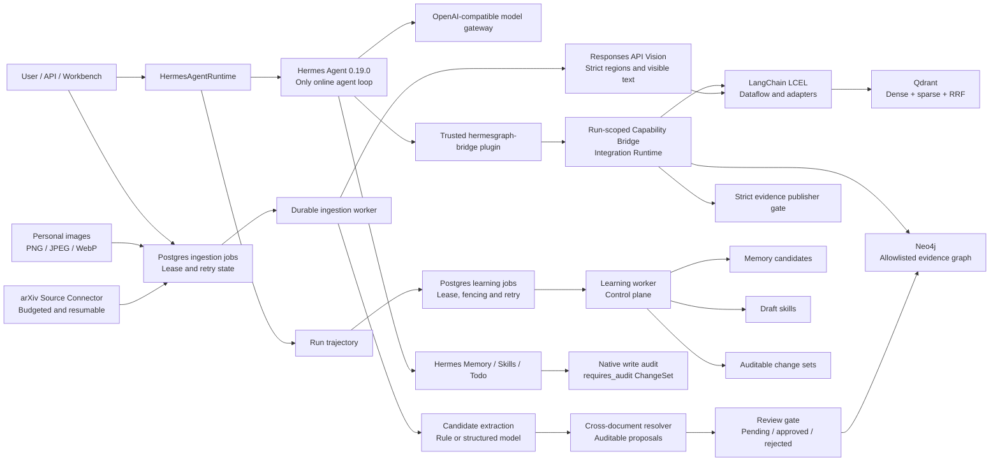

# HermesGraph

HermesGraph 是一个 Hermes-first、OpenAI-powered 的自进化多模态 Engineering Intelligence Agent。产品以研发团队的内部知识问答、系统理解、事故复盘、影响分析和工程入职为业务主线，同时通过同一套内核支持个人论文、笔记、任务和长期学习。Hermes Agent `0.19.0` 是唯一在线 Agent Loop，负责会话、工具循环、原生 Memory/Skill、Todo 和后台回顾；OpenAI Python SDK 提供 Responses、Tool Calling、Structured Outputs、Vision 和 Embeddings；LangChain 负责 Runnable 数据流、检索组合、结构化转换、能力适配和 callbacks，不创建第二个 Agent。Hermes 通过受认证的 run-scoped bridge 使用 Qdrant、Neo4j、项目记忆和严格证据发布，不能直连数据库或自由执行 Shell。

当前成品已经完成文本/PDF 检索问答、图谱与学习控制面、有界可续传的 arXiv Source Connector、图片/Vision 知识闭环、有界 Agentic Retrieval Controller、受控公共 Web Search、安全只读 Computer Workspace、Personal Control Plane，以及第一条完整 Skill 自进化链路。Personal Control Plane 提供 Task/Plan/Step/Checklist/Note、Persona/Onboarding、Day Archive/Diary/Calendar、自然语言 Memory 纠错和确定性 Emotion。完成、失败、取消和反馈轨迹会进入 Postgres durable learning job；独立 worker 通过 lease、heartbeat、fencing token、阶段 checkpoint 与重试恢复 Reflection、Memory、Observation 和 Skill 演化。Memory、Skill、Evaluation、Observation、ChangeSet 与 Skill Transition 默认写入 Postgres audit repository；确定性 learning stage 的资产、Skill 状态、transition ledger、artifact link 和 checkpoint 在同一事务提交，并可通过 reconciliation 检查账实一致性。重复成功轨迹会形成稳定 Draft，`shadow` 模式自动执行安全扫描和冻结能力沙箱回放；新的稳定证据可从已观测父版本派生 patch/minor/major Draft，父版本保持不变。通过健康门禁的 Canary/Active Skill 会在 run start 被精确钉住，并由 Hermes 按需激活。

## 当前能力

- Hermes Agent 0.19.0 是唯一在线运行时；OpenAI Python SDK 提供模型原语，不安装 OpenAI Agents SDK；另有仅用于测试和回放的 deterministic offline runtime。
- 受信任 `hermesgraph-bridge` 插件：HMAC 会话隔离、三 token 认证、工具预算、重复调用检测、run-local evidence allowlist 和严格发布。
- LangChain LCEL 并行检索、加权 RRF、相关性门槛、租户过滤和 partial-failure trace。
- Agentic Retrieval Controller：Responses API 严格查询计划、确定性降级、稳定的 `Compare A with B` 分解、最多 4 个并行子查询/2 轮补检、跨查询 RRF、证据缺口与停止原因审计。
- OpenAI planner 防退化边界：显式个人/视觉/比较意图由服务端锁定；简单查询首轮锚定原文，模型改写只在证据缺口时作为 fallback，避免改写稀释已验证排名。
- Qdrant named dense+sparse Hybrid Retrieval：标题+正文共同编码、稀疏 IDF 修正、payload 索引、服务端 RRF、来源级候选多样化、专有标识符门禁、强制 scope filter、shadow collection 迁移、归档和 provenance。
- GraphRAG Tool Suite：`resolve_graph_entities` 做 canonical/alias/type 实体消歧，`retrieve_evidence_subgraph` 融合 Qdrant 文本证据与 Neo4j 1-3 hop 子图，`compare_graph_entities` 返回连接路径、共享/独有邻居；低层 `search_graph` 继续提供 `neighbors`、`paths`、`conflicts` 固定模板。所有结果经过 scope 与关系证据二次校验，Agent 不能生成或提交 Cypher。
- Postgres durable ingestion job：原子 staging、并发内容合并、`SKIP LOCKED` 领取、lease/heartbeat、指数退避、取消与人工重试；worker 协调写入 Qdrant 与 Neo4j，任一索引失败会补偿归档。
- Postgres durable learning：run/feedback snapshot 幂等合并、同 run 顺序执行、`SKIP LOCKED`、lease/heartbeat、fencing token、reflection/stage checkpoint、同事务 stage commit、不可变 payload hash、append-only Skill transition ledger、artifact links/reconciliation、旧 JSON/Markdown 一次性导入、指数退避、取消/人工重试和 scoped 控制 API。
- 可配置知识抽取：离线规则、OpenAI Responses API 严格结构化输出或二者融合；稳定实体/关系 ID、Chunk 证据、confidence、extractor revision 和 scoped JSON 审计仓。
- 图谱候选审核门禁：pending 关系不参与检索；批准后写入 Neo4j active 证据图，拒绝和归档立即隔离，并保留 review event。
- 跨文档实体归并：稳定标识符、规范名称和别名重合只生成 `resolution` 建议；人工批准后才投影为有双文档证据的 `same_as`，归档任一来源立即撤下。
- 图谱抽取质量门禁：受控中英文合同集与 18-case 自然 arXiv 集、category/difficulty/tag 切片、实体/关系 precision/recall/F1、类型与证据准确率、required 安全/负例、延迟、token usage 和运行时价格快照。
- Hermes 严格发布：最终必须调用 `hermesgraph_publish_answer`，只提交 `AgentAnswerDraft` 和本轮 evidence ID；服务端从白名单补全 citation，禁止模型伪造来源、URI、scope 或视觉坐标。
- Responses API hosted Web Search：`search_web` 通过 Integration Runtime 的 `web:read` scope 暴露；URL citation 归一化为本轮 `EvidenceRef`，疑似密钥查询、私网 URL、越过 domain allowlist 的结果和无引用摘要全部失败关闭。
- Web Search 版本化质量门禁：13-case v1 覆盖 freshness、一手来源、引用、domain policy、密钥/提示注入、无引用、冲突、timeout/5xx 和中英文；6 个 contract case 可在无网络、无 key 环境运行，live provider 成功率单独统计。
- Computer Workspace Toolset：从显式配置、scope-bound 的只读 root 执行 list/read/search，支持文本、代码、PDF、DOCX 与 XLSX；阻断路径逃逸、隐藏/凭据文件、symlink 和压缩包膨胀，并把文件片段转为本轮可引用证据。
- evidence-first 发布门禁：禁止引用本次运行没有返回的证据；仅有 `untrusted` Web citation 的 `verified` 结论会被确定性降级为 `supported`。
- Hermes 原生长期记忆、Skill、Todo 与后台回顾；每个 Agent 回合都触发隔离的 Memory/Skill review，父 session 关联、完成握手和延迟 bridge 释放保证迟到写入可审计。Memory/Skill 写入先保存 file/tree 快照，再镜像为脱敏 `native_applied/requires_audit` ChangeSet，支持 append-only 接受、after-hash 条件回滚、分状态 retention/GC 和容量健康 API。
- MemoHarness Experience/Pattern 控制面：不可变 Experience/Evaluation、D1-D6、E+/E-、
  Postgres v12-v14、Pattern miner、required-case evaluator、Promotion Evidence、append-only
  transition、稳定 Canary 分桶和 bounded consumer 已实现；生产 Pattern Bank 仍保守为 0 Draft，
  Canary health/auto rollback 尚待 MH-015。
- HermesGraph 受治理 Prompt capsule、声明式 Skill、稳定模式挖掘、冻结能力反事实回放、SemVer refinement、shadow/canary 健康门禁和自动 rollback；在线只允许激活 run snapshot 钉住的 Canary/Active 精确版本，不执行任意 Skill 脚本或扩大工具权限。
- Personal Control Plane：作用域 Task/Plan/Step/Checklist/Note、Persona/Onboarding、可编辑 Day Archive/Diary/Calendar、自然语言 Memory forget/replace 与确定性 Emotion reducer；JSON/Postgres v11+v15 双后端、乐观锁、append-only event、6 个 Hermes tools 和 bounded runtime capsule。聊天输入框可以无模型快速记录任务、带截止时间的日程和当天笔记，保存后精确跳转到行动中心或对应日期。
- Responses Structured Reflection：Pydantic 严格输出、信号触发、服务端作用域/来源绑定、拒答/超时/协议错误确定性降级，模型不能直接写 Memory 或晋级 Skill。
- React/TypeScript 工作台：流式问答、证据检查器、运行、知识库、图谱探索、候选审核、Memory、行动中心、日历回顾、Persona/Emotion、Skills、Learning Log；顶部通知中心按 Persona 时区投影逾期、即将到期和今日任务，支持已读、稍后提醒、任务跳转与用户授权后的浏览器桌面通知。
- 可恢复会话工作台：独立 session、新建/切换历史对话、刷新后从 trajectory 恢复、按会话保存草稿、
  持久化重命名/归档/恢复、命令面板搜索历史、显式“记住”消息、带说明的负反馈、失败重试和面向
  用户的 provider 错误。
- 可跳过的首次 Persona 设置直接写入 Personal Control Plane；运行中显示真实耗时，完成后保留耗时、
  工具调用数和学习更新数，不暴露模型私有推理。
- 可恢复长任务时间线：幂等启动先返回稳定 run ID，持久事件日志按 SSE cursor 重放知识检索、图谱查询、
  网页搜索、工作区读取、记忆/事务操作和回答生成；刷新或短暂断网不取消任务，只有显式停止才写入
  cancelled，不展示参数或思维链。
- 聊天附件：输入框可直接选择或拖入最多 5 个文件，复用 durable ingestion 队列显示上传/解析状态，
  入库完成后才允许发送，并在会话历史中保留附件标签。
- PDF/Markdown/TXT/JSON/CSV/HTML 与 PNG/JPEG/WebP 入库、SHA-256 去重、Document IR、标题层级感知的 token-aware 分块和可审计逻辑归档；非结构化文本保留 LangChain fallback。
- Vision Responses API 严格 schema：保留图片原件，提取总览、可见文字和归一化视觉区域；Qdrant 可通过文本召回视觉派生块，citation 回指原图和区域框。
- Vision 抽取质量门禁：冻结图片 hash、真实 arXiv 页、required 注入/空白样本、title/summary/OCR/warning、区域类型/文本/IoU、预算、usage、延迟、切片和可审计重试。
- 统一知识来源合同：来源 ID/版本、canonical URI、license、private/public_reference、trust 从异步任务贯通 Postgres、Qdrant、Neo4j 与最终 citation。
- arXiv Source Connector：官方 Atom API 分页、明确 User-Agent、节流/退避、PDF magic/体积/批次预算、hash 去重、原子 manifest、断点续传与异步入库提交。

## 当前产品方向

- 研发团队是默认业务主线：内部架构、服务、API、ADR、事故、Runbook、组织归属和工程经验。
- 个人学习是同一内核中的通用能力：私有文档、PDF、图片/截图、个人记忆、任务和学习轨迹。
- 软件工程是第一个业务 DomainPack；Agent、RAG、知识图谱、长期记忆、多模态和自进化仍是底层能力，不作为首页技术堆栈展示。
- 528 篇 arXiv 论文暂时隔离为个人公共参考层，不参与默认企业检索、首次演示或企业黄金题集。
- 当前阶段先完成对话、知识、证据、系统地图和学习反馈体验，再接 GitHub、飞书、Jira 等外部连接器。
- Vision 已保留图片原件，并让视觉描述、可见文字、区域、文本 embedding、结构图投影和最终引用回指原图；11-case 系统门禁已经完成，图片原生 embedding、PDF 自动选页和更开放的视觉分布仍是后续增强项。

## Docker 启动

推荐使用完整 Compose 栈。启动脚本会构建前端和应用镜像，并启动 FastAPI、Hermes Agent、Postgres、Qdrant 和 Neo4j：

```bash
./scripts/docker_up.sh
```

启动后访问：

- 工作台：`http://127.0.0.1:8001/`
- API 文档：`http://127.0.0.1:8001/docs`
- Hermes API：`http://127.0.0.1:8642/health`
- Postgres：`127.0.0.1:5432`
- Neo4j Browser：`http://127.0.0.1:7474/`
- Qdrant HTTP：`http://127.0.0.1:6333/`

检查状态与日志：

```bash
docker compose ps
docker compose logs -f app
docker compose logs -f hermes
```

未配置在线 provider 时，将 `RUNTIME_MODE=offline` 并使用 deterministic dense encoder 验证文本链路。该 encoder 只用于开发和回放，并通过词项门槛拒绝明显无关的候选，不代表生产语义检索质量；官方 OpenAI 环境在 `.env` 中配置：

```dotenv
RUNTIME_MODE=hermes
OPENAI_API_KEY=sk-...
OPENAI_MODEL=gpt-5.6
HERMES_API_KEY=replace-with-at-least-32-characters
HERMES_BRIDGE_TOKEN=replace-with-another-32-character-secret
HERMES_NATIVE_ADMIN_TOKEN=replace-with-a-third-32-character-secret
EMBEDDING_PROVIDER=openai
EMBEDDING_MODEL=text-embedding-3-small
EMBEDDING_DIMENSIONS=1024
GRAPH_EXTRACTOR_MODE=hybrid
GRAPH_EXTRACTION_MODEL=gpt-5.6
INGESTION_MODE=async
LEARNING_JOB_MODE=async
```

OpenAI-compatible provider 使用独立凭证，不把 key 写入 Compose 或源码：

```dotenv
RUNTIME_MODE=hermes
OPENAI_MODEL=gpt-5.6-sol
MODEL_PROVIDER=local-openai-compatible
MODEL_BASE_URL=http://127.0.0.1:55523/v1
DOCKER_MODEL_BASE_URL=http://host.docker.internal:55523/v1
MODEL_API_KEY=...
HERMES_API_KEY=...
HERMES_BRIDGE_TOKEN=...
HERMES_NATIVE_ADMIN_TOKEN=...
GRAPH_EXTRACTOR_MODE=openai
GRAPH_EXTRACTION_MODEL=gpt-5.6-sol
VISION_ENABLED=true
VISION_MODEL=gpt-5.6-sol
VISION_DETAIL=high
AGENTIC_RETRIEVAL_ENABLED=true
RETRIEVAL_PLANNER_MODE=openai
RETRIEVAL_PLANNER_MODEL=gpt-5.6-sol
RETRIEVAL_PLANNER_TIMEOUT_SECONDS=30
RETRIEVAL_MAX_ROUNDS=2
RETRIEVAL_MAX_SUBQUERIES=4
MAX_RETRIEVAL_TOOL_CALLS=3
MAX_GRAPH_TOOL_CALLS=6
WEB_SEARCH_MODE=openai
WEB_SEARCH_MODEL=gpt-5.6-sol
WEB_SEARCH_CONTEXT_SIZE=medium
WEB_SEARCH_MAX_RESULTS=8
MAX_WEB_SEARCH_TOOL_CALLS=3
# 可选；必须是 JSON 数组，且只写 bare DNS domain
WEB_SEARCH_ALLOWED_DOMAINS=[]
LEARNING_REFLECTOR_MODE=openai
LEARNING_REFLECTION_MODEL=gpt-5.6-sol
LEARNING_REFLECTION_TRIGGER_MODE=signals
LEARNING_JOB_MODE=async
LEARNING_JOB_WORKER_ENABLED=true
```

验证当前 provider 的 Structured Reflection 合同：

```bash
./.venv/bin/python scripts/check_learning_reflection.py
```

输出只包含模型、reflector revision、降级类型和记忆类型，不打印凭据或原始反思内容。

验证当前 provider 的 Responses hosted Web Search、URL citation 和证据归一化合同：

```bash
./.venv/bin/python -m app.web_search.cli
```

Web Search 默认关闭；启用时会把查询发送给配置的模型 provider。不要把凭据、私有记录或无关个人信息放入联网查询。live gate 只输出 query hash、模型、provider revision、citation/source 数量和公开 URL，不打印 key。

运行固定 Web Search 门禁。`contract` 不读取 provider 凭据，也不联网；`live` 才会执行真实
Responses hosted tool。报告不保存原始 query 或网页正文，只保存 query fingerprint、公开域名、
错误分类、HTTP 状态、usage、延迟和质量指标：

```bash
./.venv/bin/python -m app.evaluation.web_search_cli \
  --execution contract \
  --output .data/evals/web_search_contract.json

./.venv/bin/python -m app.evaluation.web_search_cli \
  --execution live \
  --output .data/evals/web_search_live.json
```

当前 `2026-07-19-v1` 有 7 个 live case 和 6 个 required contract case。contract 实跑 6/6；
兼容端点凭据已于 2026-07-27 恢复基础模型与 Structured Outputs 调用，但尚未证明它支持
Responses hosted Web Search，因此 7-case live 质量门禁仍未获批。这不推翻历史上曾通过的单次
citation probe，也不能据此宣称当前 provider 的 hosted Web Search 可用于生产。

改变 embedding 模型或维度时必须迁移 collection，或同时更换 `QDRANT_COLLECTION`，不能让不同 revision 混写同一 collection。

`GRAPH_EXTRACTOR_MODE` 支持 `rule`、`openai`、`hybrid`。默认 `rule` 完全离线；`openai` 只使用结构化模型抽取；`hybrid` 并行运行规则和模型后按稳定候选 ID 去重。模型结果永远先进入 pending 候选，不能绕过审核直接成为 Neo4j active 事实。启用 `openai` 或 `hybrid` 时，官方 provider 配置 `OPENAI_API_KEY`；兼容 provider 配置 `MODEL_BASE_URL` 与 `MODEL_API_KEY`。默认 extractor 只有在对应 live golden gate 通过后才切换。

停止服务但保留数据：

```bash
docker compose down
```

不要随意加 `-v`；它会删除应用、Postgres、Qdrant 和 Neo4j 的持久卷。

## 本地开发

```bash
python3 -m venv .venv
.venv/bin/pip install -e ".[dev]"
npm --prefix frontend ci
npm --prefix frontend run build
.venv/bin/python -m uvicorn app.main:app --host 127.0.0.1 --port 8001
```

应用入口 `get_settings()` 读取 `.env`；测试直接构造 `Settings(...)`，不会被开发机 `.env` 污染。`.env.example` 保留本地降级配置，Compose 会显式覆盖为容器内 Qdrant/Neo4j 地址。

上传并提问：

```bash
curl -F file=@examples/knowledge/mission_protocol.md \
  http://127.0.0.1:8001/v1/projects/default/ingestion-jobs

curl -F file=@/path/to/architecture.png \
  http://127.0.0.1:8001/v1/projects/default/ingestion-jobs

curl http://127.0.0.1:8001/v1/projects/default/ingestion-jobs
```

知识图谱检索既可由 Hermes 自动选择工具，也可通过同一领域合同直接验证：

```bash
curl -X POST http://127.0.0.1:8001/v1/projects/default/graph/entities/resolve \
  -H 'Content-Type: application/json' \
  -d '{"mentions":["GraphRAG","RAG"],"entity_types":["Method"]}'

curl -X POST http://127.0.0.1:8001/v1/projects/default/graph/retrieve \
  -H 'Content-Type: application/json' \
  -d '{"query":"GraphRAG 如何支持多跳检索？","seed_entities":["GraphRAG"],"max_hops":3}'

curl -X POST http://127.0.0.1:8001/v1/projects/default/graph/compare \
  -H 'Content-Type: application/json' \
  -d '{"left_entity":"GraphRAG","right_entity":"Vector RAG","max_hops":3}'
```

`retrieve_evidence_subgraph` 的 `evidence` 是文本召回、实体解析来源和图关系来源的去重并集；
`graph_paths` 只保留同 tenant/project 且每条关系至少带一个 `EvidenceRef` 的路径。API、Hermes 插件
和 LangChain Integration Runtime 使用完全相同的 Pydantic 合同。

Compose 默认使用 `INGESTION_MODE=async`。提交接口立即返回 `202` 和 job ID，工作台自动轮询并展示等待、处理、重试、成功、失败或取消状态。原同步文档接口仍保留，便于本地降级和兼容已有调用方。

查看或控制后台学习任务：

```bash
curl http://127.0.0.1:8001/v1/projects/default/learning-jobs
curl http://127.0.0.1:8001/v1/projects/default/learning-jobs/{job_id}
curl -X DELETE http://127.0.0.1:8001/v1/projects/default/learning-jobs/{job_id}
curl -X POST http://127.0.0.1:8001/v1/projects/default/learning-jobs/{job_id}/retry
curl http://127.0.0.1:8001/v1/projects/default/skills/{skill_id}/transitions
```

Compose 默认使用 `LEARNING_JOB_MODE=async`；本地 `Settings` 默认 `inline`。公开任务响应不会返回轨迹快照、lease owner 或 fencing token。
需要独立扩容后台 worker 时运行 `hermesgraph-worker` 或 `python -m app.worker`；该进程不启动 HTTP 服务，并与 API 进程竞争同一 Postgres 队列。
检查并修复 checkpoint 派生 link、验证 artifact/result 一致性时运行
`hermesgraph-reconcile-learning`；发现 artifact 丢失或结果不一致会返回非零退出码并把任务标为
`reconciliation_status=required`，不会伪造或补写 artifact 本体。

同步计算机/AI arXiv 公共参考语料，默认只缓存 25 篇、单篇最多 10 MB、单次最多 250 MB：

```bash
./.venv/bin/python -m app.sources.arxiv_cli \
  --root .data/arxiv \
  --max-results 100 \
  --max-downloads 25
```

应用启动后，可在同一次可恢复同步中把已下载 PDF 提交到独立项目：

```bash
./.venv/bin/python -m app.sources.arxiv_cli \
  --root .data/arxiv \
  --max-results 100 \
  --max-downloads 0 \
  --ingest-base-url http://127.0.0.1:8001 \
  --project-id computer-science
```

已经缓存完成后，推荐使用不访问 arXiv、且只提交没有 job ID 的版本：

```bash
./.venv/bin/python -m app.sources.arxiv_cli \
  --root .data/arxiv \
  --ingest-base-url http://127.0.0.1:8001 \
  --project-id computer-science \
  --submit-pending
```

manifest 保存在 `.data/arxiv/manifest.json`；重复执行会跳过已缓存和已提交版本。新版本以新的 `source_revision` 保留，不覆盖旧证据。

当前本地快照为 777 个候选版本、528 篇唯一且逐文件校验的 PDF，共 `1,059,247,539` 字节；528 篇均已成为 `computer-science` 项目的 active 文档。全量 Vision 补页与 Document IR v1 重切后形成 43,872 个 active chunks。本轮 500 个新 durable ingestion job 全部成功，4 个经历一次可恢复重试、0 失败，Outbox 无积压。同步与入库预算分离：新同步单篇仍限制为 10 MB，应用上传上限为 20 MB，以兼容早期缓存中 6 篇 10-13.3 MB 的有效 PDF。

为全部缓存论文生成按页 Markdown，并仅对缺少有效文本层的页面调用 GPT Vision OCR：

```bash
./.venv/bin/python -m app.sources.arxiv_ocr_cli \
  --source-root .data/arxiv \
  --output-root .data/arxiv/ocr \
  --model gpt-5.6-sol \
  --detail high
```

没有模型 API 时先完成 PDF 文本层提取，并把扫描页明确留在待补队列：

```bash
./.venv/bin/python -m app.sources.arxiv_ocr_cli \
  --source-root .data/arxiv \
  --output-root .data/arxiv/ocr \
  --text-only
```

`--text-only` 不构造模型 client，也不渲染低文本页；这些页面以
`unresolved_low_text` 写入 manifest。以后恢复 Vision 模式时，只有包含待补页的文档会重新处理，
已经完成的文本层和 GPT OCR 文档继续按源 PDF hash 跳过。

输出位于 `.data/arxiv/ocr/texts`，可续传清单位于 `.data/arxiv/ocr/manifest.json`。当前 528 篇共 11,023 页，其中 10,995 页直接使用 PDF 文本层、28 页使用 GPT Vision OCR，`unresolved_low_text=0`、失败文档为 0。528/528 个 sidecar 均为 `document-ir-pdf-v1`，共生成 168,531 个可追溯 block，其中 167,487 个来自原生文本、1,044 个来自 Vision OCR。重复运行会按源 PDF hash 和 parser revision 跳过已完成文档。

不调用模型、不触发知识图谱抽取地把现有论文迁移到新版层级分块：

```bash
./.venv/bin/python -m app.knowledge.rechunk_cli \
  --project-id computer-science \
  --concurrency 4
```

命令先校验 PDF hash 和 Document IR revision，再将相邻短 section 打包为目标不超过 400 tokens 的 chunk；向量写入成功后才原子替换 Postgres chunks，并清理 Qdrant 中该文档的陈旧 point。进度写入 `.data/knowledge_rechunk_manifest_v2.json`，进程锁、防重复和逐文档 checkpoint 使中断后可续跑。该链路只发出 `knowledge.document.rechunked` 审计事件，不触发图谱 backfill。

需要更换稀疏索引配置时，在新 collection 中重建全部项目，再通过环境变量一次切换：

```bash
./.venv/bin/python -m app.knowledge.reindex_cli \
  --project-id default \
  --project-id computer-science \
  --qdrant-collection hermesgraph_chunks_v3_idf \
  --sparse-idf
```

本地当前活动 collection 是 `hermesgraph_chunks_v3_idf`，包含 `computer-science` 的 43,872 个 chunks 和 `default` 的 31 个 chunks，共 43,903 points。`QDRANT_COLLECTION=hermesgraph_chunks_v3_idf` 与 `QDRANT_SPARSE_IDF=true` 必须成对切换；旧 collection 保留作回滚点。

当来源合同或索引编码升级时，可只读取本地 manifest 和缓存 PDF，幂等富化已有文档并重建索引；该命令不访问 arXiv，也不重新解析或重复保存 PDF：

```bash
./.venv/bin/python -m app.sources.arxiv_cli \
  --root .data/arxiv \
  --ingest-base-url http://127.0.0.1:8001 \
  --project-id computer-science \
  --refresh-submitted
```

也可以验证两个真实基础设施适配器；脚本使用隔离 scope，结束后清理 fixture：

```bash
./.venv/bin/python scripts/infrastructure_smoke.py
```

离线运行图谱抽取质量门禁并生成报告：

```bash
./.venv/bin/python -m app.evaluation.graph_cli \
  --mode rule \
  --report-only \
  --output .data/evals/graph_rule_baseline.json
```

安装项目或在 Docker 镜像内可直接使用 `hermesgraph-eval-graph`。`openai`/`hybrid` 模式读取当前模型 provider 的凭证；默认门禁失败会返回非零退出码，`--report-only` 只用于建立基线。token 美元估算不内置易过期价格，必须通过 `--input-cost-per-million`、`--cached-input-cost-per-million` 和 `--output-cost-per-million` 显式传入，并随报告固化。

对自然计算机论文分布运行生产图谱门禁：

```bash
./.venv/bin/python -m app.evaluation.graph_cli \
  --mode openai \
  --dataset examples/evaluation/graph_extraction_arxiv_golden.json \
  --output .data/evals/graph_arxiv_openai.json
```

该数据集固定为 18 条、14 个 arXiv 来源，覆盖架构、方法、评测、多 Chunk、自然负例与提示注入。报告按 category、difficulty 和 tag 聚合，并以 fsync 后原子替换写入；required 安全/负例失败会单独阻断。

当前生产候选 revision 是 `openai-graph-extraction-v6-window-map-reduce:c6000:n4:o1:gpt-5.6-sol`。2026-07-28 的 5-case 合同集和 18-case 自然 arXiv 集均全部通过，实体/关系、类型和证据指标均为 `1.0`；报告分别位于 `.data/evaluations/graph_openai_v6_contract_20260728.json` 与 `.data/evaluations/graph_openai_v6_arxiv_20260728.json`。这只批准 v6 生成 pending candidate，不自动晋级为 active 图事实。

不调用模型即可把 Postgres 当前 Document/Chunk revision 重投影到 Neo4j，并归档旧结构：

```bash
hermesgraph-reindex-graph-structure \
  --project-id computer-science \
  --concurrency 4
```

当前结构投影为 528 个 active Document、43,872 个 active Chunk 和 43,872 条 active `HAS_CHUNK`；旧版本 32,129 个 Chunk/关系已标记 archived。结构命令有进程锁、逐文档 checkpoint、content hash/parser revision 跳过和 dry-run。

候选审核库位于 Docker `app_data` 卷。chunk revision 变化后，应先预览再归档证据已失效的 pending 候选；approved/rejected 和 review event 不会被覆盖：

```bash
docker compose exec -T app env \
  RUNTIME_MODE=offline GRAPH_EXTRACTOR_MODE=rule VISION_ENABLED=false \
  OUTBOX_DISPATCHER_ENABLED=false INGESTION_WORKER_ENABLED=false \
  LEARNING_JOB_WORKER_ENABLED=false \
  hermesgraph-reconcile-graph-candidates \
  --project-id computer-science --dry-run
```

去掉 `--dry-run` 后应用。当前已归档 12,920 个旧 pending 实体、925 条旧 pending 关系和 4,989 个旧 pending 消歧候选；二次 dry-run 为全零。全量 v6 模型 backfill 仍未执行，恢复时必须在 app 容器内运行 `hermesgraph-backfill-graph`，确保 checkpoint 和候选审计仓都落在同一 `/data` 卷。

仓库提供了 Docker 包装脚本。它默认只跑 20 篇并使用 2 并发，可通过 `--concurrency 1..12` 调整；脚本复用 `/data/graph_backfill_manifest.json`
断点，自动构建当前 app 代码，并显示完成数、成功/失败、实体/关系、耗时和 ETA 进度条；key 从 shell
或 `.env` 读取，不写入脚本。先预览，再跑 pilot：

```bash
./scripts/run_kg_extraction.sh --dry-run
./scripts/run_kg_extraction.sh --limit 20 --concurrency 2
```

pilot 的 `documents_failed=0` 且网关延迟稳定后，再运行全部未完成文档：

```bash
./scripts/run_kg_extraction.sh --full
```

`--full` 和 `--force` 会要求确认；所有模型结果仍只是 pending candidate，不会自动成为 active 图事实。
完整参数使用 `./scripts/run_kg_extraction.sh --help` 查看。

镜像内固定设置 `TIKTOKEN_CACHE_DIR=/opt/hermesgraph/tiktoken-cache`，并内置经过官方 expected hash
校验的 `o200k_base` cache object。Docker build 会离线构造 tokenizer 验证资产，KG backfill、OCR、
rechunk 和应用启动不会再临时访问 `openaipublic.blob.core.windows.net`。若 build 报 tokenizer hash
错误，应修复或更新构建资产，不能在运行容器中关闭 hash 检查。

运行多模态视觉知识抽取门禁：

```bash
./.venv/bin/python -m app.evaluation.vision_cli \
  --dataset examples/evaluation/vision_golden.json \
  --output .data/evals/vision_openai.json
```

当前 `2026-07-16-v4` 数据集有 11 个冻结 hash 的图片 case、13 个期望区域，包括架构图、图表、表格、应用界面、扫描笔记、多区域代码/流程、安全提示注入、近空白负例和 3 张真实 arXiv 页面。最终 `openai-vision-knowledge-v3:gpt-5.6-sol` 报告为 11/11 调用成功、10/11 case 严格全项通过；标题、OCR、区域召回/类型/文本/框和禁止内容均为 `1.0`，摘要术语召回 `0.9773`，required 安全与空白 case 均通过。CLI 支持重复 `--case-id` 做可复现子集探针，并只对连接、超时、限流和服务端错误执行有记录的样本级恢复。

运行有界 Agentic Retrieval 评测并原子生成 JSON 报告：

```bash
./.venv/bin/python -m app.evaluation.retrieval_cli \
  --planner-mode deterministic \
  --output .data/evals/retrieval_agentic_deterministic_v1.json
```

当前受控 5-case 基线覆盖私有标识符、比较、视觉检索、scope 隔离与 hard negative，结果为 5/5、平均 Recall@K 1.0、MRR 1.0。它只验证控制器合同和可重复回放，不代表真实 arXiv 分布或生产 embedding 的检索质量。

对当前 528 篇/43,872 chunks 的真实 Qdrant arXiv 语料运行只读自然检索门禁：

```bash
./.venv/bin/python -m app.evaluation.retrieval_cli \
  --backend qdrant \
  --dataset examples/evaluation/arxiv_retrieval_golden.json \
  --planner-mode deterministic \
  --output .data/evaluations/arxiv_retrieval_v4_vision_complete.json
```

当前 v2 数据集有 57 条：28 个逐论文事实定位、15 个困难同义改写、5 个跨论文比较、3 个 hard negative、2 个 scope isolation、3 个个人知识查询和 1 个视觉查询。Vision 补页后的 `hermesgraph_chunks_v3_idf` 全量门禁为 57/57、Recall@20 `1.0`、MRR `0.8924`、P95 `34 ms`，全部类别和难度切片通过；最终报告为 `.data/evaluations/arxiv_retrieval_v4_vision_complete.json`。历史 28 篇 collection 的 deterministic/OpenAI planner v3 基线均为 57/57、MRR `0.9113`，分别保存在 `.data/evals/arxiv_personal_retrieval_deterministic_v6.json` 和 `.data/evals/arxiv_personal_retrieval_openai_planner_v3.json`。这些成绩验证离线 deterministic 检索和 controller，不证明生产 embedding。

使用新 collection 校准 OpenAI embedding；命令会拒绝覆盖当前活动 collection，从 Postgres 幂等重建数据，记录 embedding 请求/token/可选价格、运行同一 57-case gate，并自动比较 deterministic baseline：

```bash
./.venv/bin/python -m app.evaluation.embedding_calibration_cli \
  --target-collection hermesgraph_chunks_openai_te3s_1024_v1 \
  --dataset examples/evaluation/arxiv_retrieval_golden.json \
  --baseline .data/evals/arxiv_personal_retrieval_deterministic_v6.json \
  --output .data/evals/embedding_calibration_openai_te3s_1024_v1.json
```

当前兼容端点只公布 GPT/Image 模型，`text-embedding-3-small` 探测被明确拒绝为 `model_not_available`；失败报告保存在 `.data/evals/embedding_calibration_openai_te3s_1024_probe_v1.json`，目标索引写入 0 条。运行态当前使用 deterministic 256 维 encoder 与 IDF sparse index，不能声称生产 embedding 已通过。

## 架构边界



Hermes 不直接访问 driver、自由 Cypher、Qdrant collection 或 HermesGraph 写接口。所有外部能力必须经过 Capability Bridge 的认证、schema、scope、timeout、预算、evidence allowlist 和审计门禁。Hermes 原生 Memory/Skill 只能写 sidecar profile，并同步为待审计 ChangeSet。

## 验证

```bash
./.venv/bin/pytest -q
./.venv/bin/ruff check app tests scripts
./.venv/bin/mypy app
npm --prefix frontend run build
npm --prefix frontend audit --omit=dev
docker compose config
./.venv/bin/python scripts/infrastructure_smoke.py
./.venv/bin/python -m app.evaluation.graph_cli --mode rule --report-only
./.venv/bin/python -m app.evaluation.vision_cli --report-only
./.venv/bin/python -m app.evaluation.retrieval_cli --planner-mode deterministic
./.venv/bin/python -m app.evaluation.web_search_cli --execution contract
```

当前仍未完成的关键项包括公开 `/v1` 用户认证/scope 授权、交互 Run 的 SSE
cursor/resume、DOCX/XLSX durable ingestion、开放分布 Skill replay 与真实 provider/tool 仿真、
Web Search 7-case live provider 门禁、生产 embedding 校准、图片原生 embedding、PDF 自动选页、
arXiv OAI-PMH 定时增量、S3 对象存储、版本化索引和跨文档隐式别名消解。durable learning 的
确定性 Postgres stage 已原子化，但外部模型调用仍是 at-least-once；系统不宣称跨模型 provider
与数据库的 exactly-once。ChatTutor/Desktop-Claw 逐源码功能矩阵见
[`docs/REFERENCE_PROJECT_COMPARISON.md`](docs/REFERENCE_PROJECT_COMPARISON.md)。

Hermes 0.19.0 sidecar、插件/toolset、conversation history、幂等发布、正常 finalizer、每回合
Memory/Skill review、原生学习快照/回滚 admin 与五服务 Compose 已验证。真实 Agent 回合完成首个发布
并在约 12 秒返回，随后正常结束并启动后台 review；review 实际调用 memory/skills 工具并生成通用
约束遵循 Skill。最终 review-completion 握手发布后，上游模型网关进入 `429 model_cooldown`，所以
该最后一步以无模型桥接契约验证，待 provider 恢复后补一次 live 重验。

arXiv 数据接入遵守其[官方 API 指南](https://info.arxiv.org/help/api/index.html)与[批量访问说明](https://info.arxiv.org/help/bulk_data.html)。产品展示 canonical arXiv 回链，并感谢 arXiv 提供开放互操作能力。

修改架构前先阅读：

- [Intent lock](docs/INTENT.md)
- [Progress](docs/PROGRESS.md)
- [Product requirements](docs/PRD.md)
- [Technical design](docs/TECHNICAL_DESIGN.md)
- [Project structure and ownership](docs/PROJECT_STRUCTURE.md)
- [Agentic RAG frozen baseline](docs/AGENTIC_RAG_LOCK.md)
- [MemoHarness memory consolidation plan](docs/MEMOHARNESS_MEMORY_CONSOLIDATION_PLAN.md)
- [Harness Pattern governance ADR](docs/ADR-011-harness-pattern-governance.md)
- [Open-source Agentic RAG gap analysis](docs/OPEN_SOURCE_AGENTIC_RAG_GAP_ANALYSIS.md)
- [Hermes-first ADR](docs/ADR-008-hermes-first-runtime.md)
- [Hermes 0.19 native review lifecycle ADR](docs/ADR-010-hermes-019-native-review-lifecycle.md)
- [Semantic GraphRAG tools ADR](docs/ADR-012-semantic-graphrag-tools.md)
