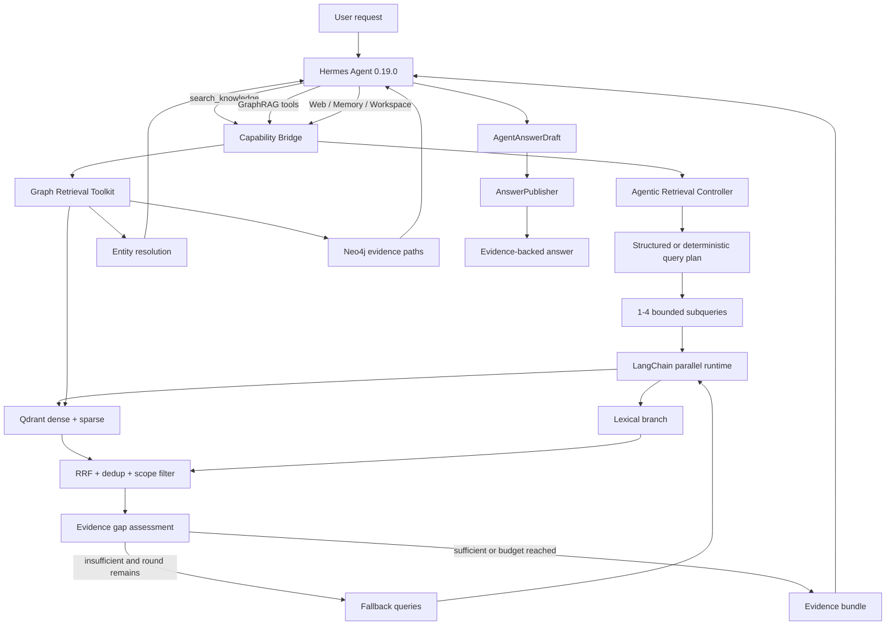

# HermesGraph Agentic RAG 冻结基线与后续实施合同

状态：`Locked / implementation deferred`

最后更新：2026-07-29

恢复条件：用户明确要求“继续 Agentic RAG”或指定本文中的 `RAG-*` 工作项。

## 1. 文档目的

本文把 HermesGraph 的 Agentic RAG 现状、定义、架构边界、已验证能力、真实缺口和后续实施顺序
固化为唯一专项基线。当前阶段只冻结设计，不继续增加 RAG 代码，避免与个人 Agent、自进化记忆、
工具系统和知识图谱回填并行推进时发生意图漂移。

本文解决五个问题：

1. 当前系统到底算不算 Agentic RAG。
2. 哪些能力已经在代码、测试和真实数据上成立。
3. 哪些能力只是接口完成、评测完成或候选数据完成，不能对外过度宣称。
4. 下一次恢复 RAG 开发时先做什么，后做什么。
5. 达到什么门槛才可以称为生产级 Agentic GraphRAG。

## 2. 最终判断

### 2.1 是否属于 Agentic RAG

**属于。当前准确名称是“有界、证据优先的 Agentic RAG v1”。**

这个判断不是因为项目使用了 Hermes、LangChain 或“Agentic”命名，而是当前检索路径已经具备：

- 运行时查询意图识别。
- Structured Outputs 或 deterministic planner 生成检索计划。
- 简单查询原文锚定，比较/综合问题分解为多个子查询。
- LangChain `abatch` 并行执行子查询。
- dense/sparse/lexical 多分支检索和跨查询 RRF 融合。
- 检索后进行 evidence count、source diversity、visual evidence 等缺口判断。
- 证据不足时使用 fallback query 进行第二轮检索。
- 显式停止原因、轮次预算、子查询预算和 partial failure trace。
- Hermes 根据任务选择知识、图谱、Web、Memory 和 Workspace 工具。
- GraphRAG 提供实体消歧、证据子图、实体比较和 1-3 hop 固定模板遍历。
- 最终回答只能引用本次运行返回的 evidence ID，并经过服务端发布门禁。

普通 RAG 通常是固定的 `query -> top_k -> prompt -> answer`。HermesGraph 已经实现
`plan -> retrieve -> assess gap -> optionally retrieve again -> select graph/other tools -> publish with evidence`，
因此满足 Agentic RAG 的核心行为标准。

### 2.2 为什么还不能称为“完整生产级 Agentic GraphRAG”

当前仍有五个关键限制：

1. 生产 embedding 尚未通过 live gate，528 篇当前主索引仍以 deterministic dense + sparse IDF 为主。
2. 语义 KG backfill 尚未完成，已抽取结果仍是 pending candidate，active 语义实体/关系不能按全库宣称。
3. gap assessment 主要检查数量、来源多样性和视觉证据，尚未把 required-term 缺失作为硬缺口。
4. `AnswerPublisher` 验证 evidence ID、scope 和 trust，但不验证 claim 文本是否真的被证据蕴含。
5. 没有学习型 reranker，当前候选排序主要依赖 Qdrant RRF、branch weight 和相关性阈值。

所以当前可以对外描述为：

> Hermes-first 的有界 Agentic RAG，支持多轮混合检索、证据缺口补检、GraphRAG 工具和严格引用发布。

当前不应描述为：

> 已完成 528 篇全量语义知识图谱、生产语义 embedding、自动事实验证和完全自治研究 Agent。

## 3. 与普通 RAG 的行为对比

| 能力 | 普通 RAG | HermesGraph 当前状态 |
| --- | --- | --- |
| 查询处理 | 原查询直接检索 | 规划、意图锁定、比较分解、fallback query |
| 检索轮次 | 固定一次 | 最多两轮，按 evidence gap 决定是否继续 |
| 检索分支 | 单向量库 | lexical + Qdrant dense/sparse + GraphRAG + 可选 Web/Memory/Workspace |
| 并行检索 | 通常没有 | 最多 4 个子查询使用 LangChain `abatch` |
| 融合 | top-k 或简单拼接 | 分支内 RRF + 跨查询 RRF + 去重 + scope 二次过滤 |
| 图谱 | 通常没有 | 实体解析、证据子图、实体比较、模板化 1-3 hop |
| 缺口判断 | 通常没有 | evidence/source/visual 缺口和停止原因 |
| 工具决策 | 固定 pipeline | Hermes 在线决定使用知识、图谱、Web、Memory 或文件工具 |
| 证据约束 | Prompt 要求引用 | 服务端 evidence allowlist 和 claim/citation contract |
| 失败处理 | 整体失败 | planner fallback、branch partial failure、insufficient 降级 |
| 轨迹学习 | 通常没有 | trajectory、reflection、Memory/Skill 和受治理学习闭环 |

## 4. 当前总体架构



### 4.1 唯一 Agent Loop

Hermes 是唯一在线 Agent Loop。`AgenticRetrievalController` 是有界检索数据流，不进行开放式工具
循环，不创建会话，不拥有最终回答，也不能修改 capability。LangChain 只执行 Runnable、并行检索、
适配、重试和 callbacks。

### 4.2 两层 Agentic 行为

第一层是 Hermes 的任务级工具选择：

- 何时查个人知识。
- 何时调用 GraphRAG。
- 何时需要 Web Search。
- 何时读取项目 Memory 或本机文件。
- 何时停止并发布答案。

第二层是 `search_knowledge` 内部的检索控制：

- 如何分解查询。
- 如何并行搜索。
- 如何判断证据不足。
- 是否执行第二轮补检。
- 如何融合和记录结果。

两层职责不同，不构成双 Agent Loop。

## 5. 当前能力清单

### 5.1 知识摄取

已实现：

- PDF、Markdown、TXT、JSON、CSV、HTML、DOCX、XLSX 和图片摄取。
- PDF 文本层、GPT Vision OCR 和原始媒体保留。
- `DocumentIR`、标题层级、页面、block kind 和 extraction method。
- `o200k_base` token-aware 分块、短 section 合并和原子 chunk replacement。
- Postgres durable ingestion job、lease、heartbeat、retry、cancel 和 reconciliation。
- Qdrant、Neo4j 和 Postgres 写入补偿。
- source contract、privacy、trust、canonical URI、content hash 和 revision provenance。

当前数据：

- 528 篇 active computer-science 文档。
- 43,872 个 active chunks。
- 11,023 个 PDF 页面已完成文本化。
- 10,995 页使用原生文本层，28 页使用 Vision OCR。

### 5.2 混合检索

已实现：

- Qdrant named dense/sparse vector。
- sparse IDF modifier。
- lexical fallback branch。
- 标题和正文共同编码。
- server-side RRF。
- branch weight、relative threshold、source diversity 和 dedup。
- tenant/project filter 同时作用于 query、prefetch 和应用层二次检查。
- deterministic dense 的额外词项门槛，防止弱候选被 RRF 错误抬升。
- collection revision 迁移和 stale point cleanup。

受限项：

- 当前 compatible endpoint 没有可用 embedding 模型。
- deterministic dense 只适合开发和回放，不能代表生产语义质量。
- 学习型 cross-encoder/late-interaction reranker 尚未实现。

### 5.3 Agentic Retrieval Controller

已实现：

- OpenAI Structured Outputs planner 和 deterministic fallback。
- `lookup/compare/synthesis/personal_recall/visual_lookup` 意图。
- 显式个人、视觉、比较意图的服务端锚定。
- 最多 4 个子查询，最多 2 轮。
- 简单查询首轮保留原文，模型改写只作为补检候选。
- LangChain `abatch` 并行。
- branch failure 不污染成功分支。
- 跨查询 RRF。
- evidence/source/visual gap assessment。
- `coverage_satisfied/no_new_queries/round_limit` 等停止原因。
- planner usage、fallback error、round result 和 decision trace。

当前弱点：

- `required_terms` 会被计算并记录 covered/missing，但 missing term 当前没有进入 `reasons`，因此不会
  单独阻止 `sufficient=true`。
- gap assessment 不执行 claim-level entailment。
- 最多两轮适合在线有界问答，不适合长时间开放式研究任务。
- planner 的 `recommends_graph_search` 当前主要写入 trace，图谱工具仍由 Hermes 决定是否调用。

### 5.4 GraphRAG

已实现：

- typed Graph node、relationship、path 和 evidence contract。
- 只允许 `neighbors/paths/conflicts` 固定模板，不接受自由 Cypher。
- `resolve_graph_entities`：canonical name、alias、type 和 evidence 消歧。
- `retrieve_evidence_subgraph`：文本检索与实体解析并行，再扩展 evidence-backed path。
- `compare_graph_entities`：连接路径、共享邻居、左右独有邻居。
- graph path 必须具有 relationship evidence。
- 节点、关系和 evidence 强制 tenant/project scope。
- 跨文档 resolution 候选和批准后的 `same_as`。
- pending/approved/rejected/archived 和 review ledger。

当前数据真实性：

- 结构图已有 528 Document、43,872 Chunk、43,872 `HAS_CHUNK`。
- v6 模型抽取质量门禁已经通过。
- 全库语义 KG backfill 尚未完成。
- 模型输出首先进入 pending candidate，不能直接参与 active GraphRAG。
- 未经审核的实体关系不能被描述为生产事实。

### 5.5 证据与发布

已实现：

- 每个工具结果返回 scoped `EvidenceRef`。
- Bridge 维护 run-local evidence allowlist。
- Agent 只能提交 evidence ID，不能自行构造 URI、page、bbox 或 provenance。
- supported/verified claim 必须包含 evidence ID。
- claim evidence 必须出现在最终 citation 中。
- verified claim 只能使用 verified-trust evidence。
- Web evidence 的 untrusted trust 会确定性降低 verified confidence。
- 无引用 supported answer 被拒绝。

当前弱点：

- Publisher 验证“引用是否存在且可信”，不验证“引用正文是否语义支持 claim”。
- citation coverage 是结构覆盖，不等于 entailment accuracy。
- publisher rejection 后是否补检仍取决于 Hermes 下一步行为，没有独立确定性 repair policy。

### 5.6 多模态检索

已实现：

- 图片原件、OCR、summary、region、bbox 和 visual evidence。
- PDF 低文本页 Vision OCR。
- 图片派生文本进入统一检索和 citation。
- `visual_lookup` intent 和 visual evidence gap。

受限项：

- 没有图片原生 embedding。
- 没有 PDF 自动选页的开放式视觉检索。
- 跨页图表、视觉关系和更开放图片分布仍需扩展。

### 5.7 Memory、Skill 与自进化

已实现：

- episodic、semantic、procedural、policy 四类 Memory contract。
- run start capsule 和 scope-bound Memory retrieval。
- Hermes 原生 Memory/Skill 写前快照、审计和条件回滚。
- 重复轨迹 Skill miner。
- 冻结能力 replay、shadow、canary、active 和 rollback。
- retrieval trace、feedback、reflection 和 ChangeSet。

受限项：

- MemoHarness E/G 经验银行、run overlay、bounded consumer 与 health/auto rollback 已实现。
- RAG 参数只会在 Pattern 通过离线门禁和人工 Canary/Active 后有界调整；当前 0 Pattern，不会伪造优化。
- Memory 目前是单独能力，不是每次知识搜索都自动混入。

## 6. 成熟度矩阵

| 模块 | 成熟度 | 判断 |
| --- | --- | --- |
| 文档摄取与 provenance | 已完成 v1 | durable、可恢复、真实 528 文档 |
| Document IR 与 chunk | 已完成 v2 | 层级 token-aware，全量迁移完成 |
| Qdrant hybrid retrieval | 已完成开发/回放版 | dense+sparse+IDF+RRF 完整，生产 embedding 未通过 |
| Agentic query planning | 已完成有界 v3 | Structured planner、fallback、意图锚定和评测完成 |
| 多轮 gap-driven retrieval | 已完成基础版 | 最多两轮，但 gap 语义仍浅 |
| GraphRAG 工具 | 后端完成 | contract 和真实 Compose 通过，active 语义数据不足 |
| KG 抽取 | 进行中 | v6 gate 通过，全库 backfill/review 未完成 |
| 严格引用发布 | 已完成基础版 | ID/scope/trust 强，entailment 未实现 |
| 多模态 RAG | 已完成首条纵向闭环 | 文本派生检索成熟，原生视觉检索待做 |
| Web Search | adapter/contract 完成 | 当前 provider live gate 未通过 |
| RAG 自优化 | 设计完成 | MemoHarness fixed-memory/overlay 未实现 |
| 生产认证与恢复 | 部分完成 | 内部 bridge 强，公开 API auth/SSE resume 仍缺 |

## 7. 代码事实映射

| 能力 | 主要代码 |
| --- | --- |
| Agentic planner/controller | `app/retrieval/agentic_retrieval.py` |
| LangChain parallel + RRF | `app/retrieval/hybrid_retrieval_pipeline.py` |
| Qdrant hybrid | `app/retrieval/qdrant_hybrid_retriever.py` |
| GraphRAG semantic tools | `app/graph/graph_retrieval_tools.py` |
| Neo4j scoped adapter | `app/graph/neo4j_evidence_graph.py` |
| Structured KG extraction | `app/graph/openai_graph_extractor.py` |
| KG candidate governance | `app/graph/graph_candidate_service.py`、`candidate_store.py` |
| Capability integration | `app/capabilities/runtime.py` |
| Hermes tool boundary | `app/agent/hermes_bridge.py` |
| Strict answer publishing | `app/agent/answer_publisher.py` |
| Run instructions | `app/agent/instructions.py`、`prompts/hermes_runtime.md` |
| Retrieval evaluation | `app/evaluation/retrieval_cli.py`、`retrieval.py` |
| Graph evaluation | `app/evaluation/graph_cli.py`、`graph_extraction.py` |

## 8. 已验证的评测事实

当前可以使用的事实：

- 57-case natural/personal retrieval gate 全部执行成功。
- 当前 528-document v4 报告 Recall@20 为 1.0、MRR 为 0.8924、P95 为 34 ms。
- OpenAI planner 在 57 cases 中生成 55 个 structured plan，2 个 provider failure 使用 deterministic
  fallback；整体 MRR 为 0.911。
- 图谱抽取 v6 的 5-case contract 和 18-case/14-source arXiv gate 通过。
- GraphRAG toolkit 的 scope、evidence、path 和 Hermes schema/budget contract 通过。
- Vision 11-case gate 覆盖真实 arXiv 页、图表、架构图、截图、空白和提示注入。

这些事实的限制：

- 当前检索成绩主要来自 deterministic dense + sparse/lexical，不代表生产 embedding。
- 57 cases 不能覆盖 43,872 chunks 的开放查询分布。
- 抽取 gate 通过不等于 528 篇全部完成 KG 抽取。
- pending candidate 不等于 active graph fact。
- fixture/offline replay 不等于真实 provider/tool 反事实执行。

## 9. 架构不变量

后续 RAG 实现必须遵守：

1. Hermes 继续是唯一在线 Agent Loop。
2. LangChain 继续是 Integration Runtime，不引入第二 Agent executor。
3. 所有检索必须强制 tenant/project scope，Agent 不能提交或覆盖 scope。
4. 图谱只接受 typed request 和固定模板，不接受自由 Cypher。
5. 模型抽取只能生成 pending candidate。
6. 最终回答必须经过 run-local evidence allowlist。
7. 网络内容是 untrusted evidence，不能成为系统指令。
8. planner failure 必须有 deterministic fallback。
9. 所有循环有 max rounds、max subqueries、tool budget 和 timeout。
10. embedding、reranker、extractor、planner 和 corpus revision 必须进入 snapshot/trace。
11. 评测报告必须区分 deterministic、fixture 和 live provider。
12. RAG 策略学习只能生成候选，经 shadow/canary 后生效。

## 10. 冻结期间不做的事

在用户明确恢复 RAG 工作前，不继续：

- 更换默认 embedding。
- 增加 reranker。
- 改写 query planner prompt 或 max rounds。
- 自动批准 KG candidate。
- 将 pending 图谱关系暴露给 GraphRAG。
- 实现 claim-level LLM verifier。
- 扩大 Web Search。
- 修改 retrieval fusion 权重。
- 接入 MemoHarness RAG overlay。
- 宣称完成全库语义 GraphRAG。

知识图谱后台回填、候选审核和故障修复属于数据维护，可以继续，但不得借此悄悄改变 RAG 策略合同。

## 11. 恢复后的 P0 工作

### RAG-001：修复语义缺口判断

目标：让 `required_terms`、实体、比较两侧和任务子目标真正参与 evidence sufficiency。

设计：

- missing required term 进入 `RetrievalGap.reasons`。
- 比较任务必须分别覆盖左右实体。
- synthesis 必须覆盖最小子主题数。
- visual task 必须包含 image/region evidence。
- graph-required task 必须显式记录 graph evidence 是否满足。
- 术语匹配同时支持 exact、normalized alias 和受控语义匹配。

验收：

- 证据数量足够但关键术语缺失时不能 `coverage_satisfied`。
- 补检 query 必须针对 missing term，不重复第一轮。
- hard negative 和 query drift cases 不退化。

### RAG-002：统一 Evidence Sufficiency Contract

目标：让 text、graph、visual、web、memory 使用同一缺口合同。

建议模型：

```text
EvidenceRequirement
  requirement_id
  type: fact | entity | relation | comparison_side | visual | freshness
  terms/entities
  minimum_sources
  required_trust
  satisfied_by_evidence_ids
  status: satisfied | missing | conflicting
```

Hermes 决定工具，服务端 requirement tracker 决定哪些证据缺口仍存在。它不是第二 Agent Loop。

### RAG-003：Claim-Evidence Verifier

目标：补上 Publisher 只有结构校验、没有语义蕴含校验的缺口。

分两层：

1. deterministic checks：数字、版本、命名实体、否定词、时间和 citation span overlap。
2. optional Structured Outputs verifier：只判断 claim 是否被给定 evidence 支持、冲突或证据不足。

模型 verifier 只能返回判定候选；服务端绑定 claim/evidence IDs，安全和 scope 仍由 deterministic gate
决定。verifier unavailable 时必须降低 confidence，不能假装 verified。

### RAG-004：Publisher Repair Policy

目标：当引用覆盖或 verifier 失败时，系统能确定性选择：

- 再检索一次指定缺口。
- 删除不受支持的 claim。
- 降级为 insufficient。
- 请求用户澄清。

repair 有且只有一次预算，不能形成无限生成-验证循环。

### RAG-005：真实 Hermes 纵向门禁

至少验证：

- Hermes 创建 run。
- 正确选择 `search_knowledge` 或 GraphRAG 工具。
- Bridge 记录 tool events。
- Controller 产生 plan、round 和 gap trace。
- evidence ID 进入 allowlist。
- Hermes 调用 `hermesgraph_publish_answer`。
- Publisher 拒绝伪造 citation。
- RunTrajectory 和 learning job 完整落盘。

## 12. 恢复后的 P1 工作

### RAG-006：生产 Embedding 校准

- 在隔离 collection 中重建 528-document corpus。
- 固化 model、dimensions、batch、usage 和 cost revision。
- 运行 57-case 和新增开放查询集。
- 与 deterministic baseline 比较 Recall@k、MRR、nDCG 和 latency。
- 达到门槛后使用 alias 或 shadow collection 原子切换。
- 失败时不修改 active collection。

### RAG-007：学习型 Reranker

- 第一阶段只对 top 30-50 candidates 重排。
- 输入只包含有界 query、title、heading、chunk preview 和 source metadata。
- 输出 stable candidate IDs 和 scores。
- 评测必须证明 MRR/nDCG 提升且 P95/cost 可接受。
- reranker failure 回退到 RRF，不中断检索。

### RAG-008：完成语义 KG 数据面

- 完成 528 篇 v6 backfill。
- 对 timeout 使用 checkpoint 重试，不覆盖 completed。
- candidate 去重、冲突和 resolution 对账。
- 分层人工审核或高精度规则审核。
- 只有 approved relation 投影到 active Neo4j。
- 建立 active graph retrieval gate，不能只测 candidate extractor。

### RAG-009：Graph-Aware Requirement Closure

- planner 只生成 typed `requires_relation/requires_path` requirement。
- Hermes 仍负责调用 GraphRAG 工具。
- requirement tracker 检查返回路径是否 evidence-backed。
- graph empty 时回退 text evidence 或声明关系证据不足。
- 不允许 controller 自行生成 Cypher。

### RAG-010：持久检索事件与 Resume

- 持久化 plan、round、branch、gap、tool 和 publish event。
- SSE 使用 cursor/idempotency key 支持断线恢复。
- 事件正文继续有界、脱敏，只保存必要 query hash 和 evidence IDs。

## 13. 恢复后的 P2 工作

- 图片原生 embedding 和跨模态 reranker。
- PDF 自动视觉选页和跨页图表关系。
- 长任务 Research Plan/Task/Note 控制面。
- 时间感知和版本感知检索。
- contextual compression，但必须保留原始 evidence span。
- retrieval cache 和 semantic cache，必须 scope/revision-aware。
- MemoHarness E/G Pattern 驱动的 bounded RAG overlay。
- 用户显式可见的策略解释和回滚 UI。

## 14. 目标检索闭环

下一阶段目标不是增加无限 Agent 自治，而是把当前闭环变得更准确：

```text
User query
  -> Hermes selects retrieval capability
  -> typed intent and evidence requirements
  -> bounded query plan
  -> parallel hybrid retrieval
  -> graph/visual/web branch when required
  -> candidate rerank
  -> requirement-level gap assessment
  -> one bounded repair retrieval
  -> claim-evidence verification
  -> strict publish or insufficient
  -> trace, feedback and governed learning candidate
```

## 15. 评测集扩展

恢复后新增 cases：

- 关键术语缺失但 evidence count 足够。
- 比较题只找到一侧。
- 图关系问题只有文本共现，没有关系证据。
- 同名实体跨论文歧义。
- 多版本软件/API 时间冲突。
- private/public source 冲突。
- 文档提示注入试图改变检索规则。
- 引用存在但不支持 claim。
- 数字、单位、否定和时间被错误归纳。
- graph empty、web unavailable、embedding failure 和 reranker failure。
- 中英文 query 与英文论文 evidence。
- 图片 OCR 正确但区域定位错误。

## 16. 核心指标

检索指标：

- Recall@5/10/20。
- MRR、nDCG@10。
- source diversity。
- required evidence coverage。
- graph path evidence accuracy。
- query drift rate。
- second-round useful evidence gain。

回答指标：

- claim support precision。
- citation coverage。
- citation entailment accuracy。
- unsupported claim rate。
- insufficient-evidence calibration。
- user correction rate。

系统指标：

- planner/provider success rate。
- fallback rate。
- branch failure rate。
- P50/P95 latency。
- input/output token usage。
- per-run tool calls。
- cache hit rate。
- cross-scope leakage，必须为 0。

## 17. 分阶段验收门槛

### P0 完成门槛

- required-term/requirement gap cases 100% 通过。
- Publisher 不再仅凭 evidence ID 将语义不支持 claim 视为 supported。
- claim verifier required negative cases 100% 通过。
- 真实 Hermes E2E 至少覆盖 lookup、compare、graph、visual、insufficient 五类。
- planner 或 verifier 不可用时 deterministic fallback 正确。

### P1 完成门槛

- 生产 embedding 在隔离 gate 中不低于当前 baseline。
- reranker 对 MRR/nDCG 有可重复提升，核心 Recall 不退化。
- active graph 具有真实 approved semantic entities/relations。
- GraphRAG active-data gate 通过，不依赖 fixture。
- full corpus backfill、review 和 reconciliation 有明确完成报告。

### Production-ready 门槛

- live provider、Qdrant、Neo4j、Postgres 和 Hermes 纵向闭环通过。
- 公开 API auth/scope binding 完成。
- 持久 event stream 和断线恢复完成。
- 所有 required security cases 通过。
- backup/restore、worker crash、index migration 和 rollback 演练通过。
- 指标与成本在真实使用窗口稳定。

## 18. Definition of Done

只有同时满足下列条件，才可以称为“生产级 Agentic GraphRAG”：

1. Query plan、tool routing、multi-round retrieval 和 stop decision 全部可审计。
2. 生产 dense/sparse 检索与 reranker 通过真实质量门禁。
3. 528 篇语义 KG 完成抽取、审核、active 投影和对账。
4. GraphRAG 回答使用真实 active relationship evidence。
5. evidence requirement 和 claim entailment 都进入运行时门禁。
6. unsupported claim 不会因为挂了一个 citation ID 就通过。
7. text、graph、visual、web、memory 的 scope 和 provenance 统一。
8. provider、branch 和图谱不可用时稳定降级。
9. 真实 Hermes 发布闭环和持久 trace 通过。
10. 学习只生成候选策略，不能绕过评测和权限边界。

## 19. 恢复实施顺序

恢复 RAG 开发时严格按以下顺序：

```text
RAG-001 semantic gap
  -> RAG-002 requirement contract
  -> RAG-003 claim verifier
  -> RAG-004 repair policy
  -> RAG-005 real Hermes E2E
  -> RAG-006 production embedding
  -> RAG-007 reranker
  -> RAG-008 active semantic KG
  -> RAG-009 graph requirement closure
  -> RAG-010 persistent event resume
```

KG 数据回填可以与 P0 并行，但 active 投影必须等待审核门禁。不能先做 reranker UI、复杂研究模式或
RAG 自学习，再补基础 evidence correctness。

## 20. 恢复检查清单

用户要求恢复 Agentic RAG 时，先执行：

1. 读取本文和最新 `PROGRESS.md`。
2. 审计当前 corpus、Qdrant collection、KG checkpoint 和 active candidate 数量。
3. 确认当前 provider 是否支持 embedding、Responses parse 和 Web Search。
4. 重跑现有 57-case retrieval baseline，不能使用历史报告代替。
5. 从 `RAG-001` 开始，不直接跳到 UI、reranker 或自优化。
6. 每完成一个工作项，更新本文状态、Progress、测试数和真实指标。

## 21. 冻结结论

HermesGraph 当前已经是 Agentic RAG，而不是普通 RAG 包装。它最突出的优点是架构边界清晰、检索
有界、GraphRAG 工具语义明确、scope 强制、证据发布严格、轨迹和评测完整。它当前最明显的短板不是
“没有 Agent”，而是生产语义质量的最后一公里：真实 embedding、active KG、深层 gap assessment、
claim-evidence entailment 和真实 Hermes E2E。

RAG 工作从 2026-07-29 起按本文冻结。后续先完善个人 Agent、自进化、Memory、Tool 和任务控制面；
重新进入 RAG 时从 `RAG-001` 恢复，不重新讨论框架，不引入第二 Agent Loop，也不推翻已完成的数据
和证据合同。
