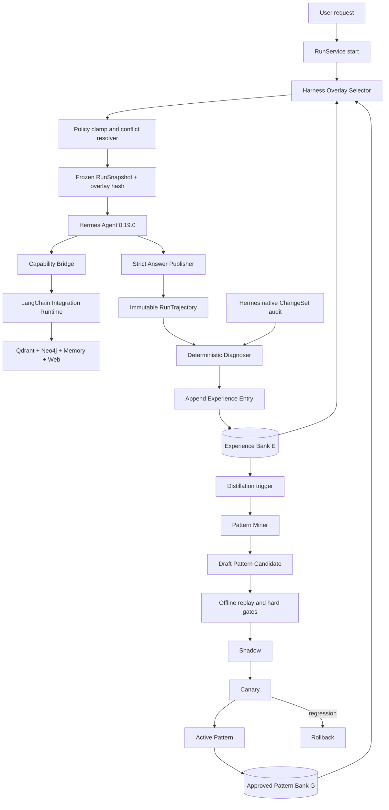

# MemoHarness 固定化记忆与 Harness 自适应实施规划

状态：`Phase 1-4 implemented / Phase 5 bounded consumer implemented`

最后更新：2026-07-31

适用项目：HermesGraph

参考论文：*MemoHarness: Agent Harnesses That Learn from Experience*，arXiv:2607.14159v1

## 1. 文档目的

本文定义如何把 MemoHarness 的经验银行、失败诊断、全局模式蒸馏和测试时适配思想，接入现有
Hermes-first 自进化架构，用于改进固定化记忆、检索策略和任务编排，同时保证：

1. Hermes Agent `0.19.0` 继续是唯一在线 Agent Loop。
2. Hermes 原生 Memory、Skill、Todo 和后台回顾继续由 Hermes 独占写入。
3. HermesGraph 不复制 Hermes 的原生学习器，也不创建第二个相互竞争的学习 Agent。
4. 新模块只从已有轨迹和审计事件中学习，产出受治理候选，不能直接改变生产行为。
5. 每个运行使用的策略版本必须冻结在 `RunSnapshot`，运行中不得自我改写。
6. 任何经验都不能扩大工具权限、文件范围、网络范围、租户作用域或发布权限。
7. 第一阶段完全不依赖模型 API，后续模型只能增强诊断和候选生成，不能成为唯一门禁。

本文同时保留目标设计和实际实施状态。当前已完成 Experience/Evaluation、D1-D6、Postgres
v12/v13/v14、Pattern Draft miner、E+/E-、Pattern evaluator、Promotion Evidence、append-only
transition ledger、observe/shadow overlay、bounded Canary/Active consumer，以及 applied/control
Canary health 与 auto rollback。生产 Pattern Bank 仍为 0，因此能力完成不等于效果已验证。
实际完成状态以本文件第 19、26 节、`PROGRESS.md` 和测试报告为准。

## 2. 结论先行

### 2.1 是否与 Hermes 原生进化冲突

按本文边界实施时不冲突。两者处理的是不同层次的问题：

| 层次 | 唯一所有者 | 学习速度 | 主要产物 | 发布语义 |
| --- | --- | --- | --- | --- |
| 个人即时学习 | Hermes | 快 | 原生 Memory、原生 Skill、Todo | 先应用，后审计，可条件回滚 |
| 项目经验采集 | HermesGraph | 快 | 不可变 Experience Entry | 只记录，不改变行为 |
| 跨任务固定化 | HermesGraph | 慢 | Semantic Memory、Governed Skill、Harness Pattern | 先候选、评测，再晋级 |
| 单次运行适配 | HermesGraph | 每个 run 一次 | Run-scoped Harness Overlay | 只使用已批准模式，run start 冻结 |
| 权限与安全 | HermesGraph 服务端 | 不学习 | Capability、scope、budget hard cap | 不允许被任何学习结果修改 |

MemoHarness 思想在本项目中的定位是 **经验归纳和固定化控制面**，不是新的 Agent runtime，也不是
第二套原生 Memory/Skill 写入器。

### 2.2 采用什么，不采用什么

采用：

- 每个任务形成不可变的逐案例经验条目 `E`。
- 把成功和失败经验分开检索，避免只模仿成功或只累计错误。
- 按 D1-D6 六个维度诊断问题来源。
- 从重复经验蒸馏版本化全局模式 `G`。
- 以正确性为第一目标，成本仅作为质量相当时的次级目标。
- 测试时只做一次有界适配，得到 run-scoped `W(x)`。
- 全局模式、单次 overlay、输入证据和结果均可追溯、回放和回滚。

不采用：

- 不允许 MemoHarness controller 接管 Hermes 在线工具循环。
- 不允许自由生成并直接注入任意 system prompt。
- 不允许根据当前 run 的中间结果在运行中修改自身配置。
- 不允许训练或改写基础模型权重。
- 不允许直接写 Hermes 的 `MEMORY.md`、`USER.md` 或原生 Skill 目录。
- 不允许把一次成功、一次模型自评或一条外部文档内容直接固化为永久策略。
- 不照搬论文中的自由搜索空间；本项目只允许修改服务端声明的有界旋钮。

## 3. 术语与项目映射

| 论文/本文术语 | 含义 | HermesGraph 对应物 |
| --- | --- | --- |
| `W*` | 当前已批准的全局 harness 配置 | Active `HarnessPolicyBundle` |
| `E_t` | 截至时间 t 的逐案例经验银行 | `HarnessExperienceEntry` append-only 表 |
| `G_t` | 从经验中蒸馏的全局模式银行 | 版本化 `HarnessPattern` |
| `B_t=(E_t,G_t)` | 双层经验银行 | Experience Store + Pattern Registry |
| `W(x)` | 针对当前请求的一次性配置 | `RunHarnessOverlay` |
| Diagnosis | 任务主要/次要失败维度和原因 | deterministic diagnoser + optional model proposal |
| Distillation | 从重复经验生成一般模式 | deterministic pattern miner + governed promotion |
| Fixation/Consolidation | 从短期经验形成长期资产 | Memory/Skill/Policy 三路固定化 |
| Harness | Agent 周围的上下文、工具、生成、编排、记忆、输出控制 | HermesGraph Integration Runtime 与服务端策略 |

### 3.1 “固定化记忆”在本项目中的准确含义

固定化不是把一段完整对话追加到 Prompt。它是把短期经验按语义分流，形成具有来源、范围、版本、
证据、失效条件和回滚路径的长期资产：

1. 可验证事实或明确个人偏好进入 `Semantic Memory`。
2. 重复、稳定、可复用的动作序列进入 `Procedural Skill`。
3. 检索、上下文、停止规则和输出门禁经验进入 `Harness Policy`。
4. 单次任务细节保留为 `Episodic Experience`，默认不直接影响全部后续任务。

这三种长期资产必须分开管理，不能使用一个通用 `memory_text` 字段混在一起。

## 4. 意图锁定与硬性不变量

以下规则是代码、测试和评审的共同门禁：

1. **唯一 Agent Loop**：只有 Hermes 可以决定下一次在线 tool call。
2. **唯一资产所有者**：同一份原生 Memory/Skill 不允许 Hermes 和 HermesGraph 双写。
3. **运行冻结**：overlay 在 run start 产生并写入 snapshot，运行中不可更新。
4. **候选先行**：Experience 只能生成 candidate，不能直接生成 active policy。
5. **权限单调不增**：学习后可用 capability 集合必须是服务端原集合的子集或等集。
6. **预算上界不增**：overlay 只能在服务端 hard cap 内调整，不能提高 hard cap。
7. **作用域不可学习**：tenant、project、user、workspace root 永远由服务端绑定。
8. **证据优先**：低引用覆盖率不能通过更强措辞或更长回答来“修复”。
9. **无当前标签泄漏**：生成当前 run overlay 时不得读取当前 run 的结果或人工标签。
10. **可重放**：同一 snapshot、经验银行 revision 和 selector revision 应产生相同 overlay。
11. **敏感信息不入库**：原始密钥、完整工具输出、私有绝对路径和未脱敏正文不得进入经验模式。
12. **失败关闭**：选择器、模式仓或数据库不可用时使用全局安全基线，不猜测配置。

## 5. 总体架构



### 5.1 在线关键路径

在线增加的同步工作必须保持很小：

```text
request
  -> extract deterministic case features
  -> read current active pattern index
  -> retrieve bounded positive/negative experience summaries
  -> select at most N compatible patterns
  -> merge, clamp and hash overlay
  -> freeze snapshot
  -> start Hermes run
```

诊断、经验写入、模式蒸馏和评测均在 run 终态后通过现有 durable learning job 执行，不能阻塞首 token。

### 5.2 控制面与数据面

数据面：Hermes 在线运行、工具调用、检索、证据发布。

控制面：轨迹采集、诊断、经验银行、模式生成、离线回放、状态晋级、自动回滚。

控制面可以提出数据面的有界配置，但不能直接执行在线工具，也不能修改安全策略。

## 6. D1-D6 六维 Harness 设计

所有可学习字段必须在 typed schema 中提前声明。字符串形式的任意 Prompt patch 不进入第一阶段。

### 6.1 D1 Context

可学习旋钮：

- `capsule_memory_limit`：本次最多注入多少条已批准 Memory。
- `capsule_skill_limit`：discovery index 最多展示多少条 pinned Skill。
- `private_evidence_quota`：私有来源候选保留比例下限。
- `public_reference_quota`：公共论文候选比例上限。
- `context_evidence_bytes`：证据上下文预算，受服务端 hard cap 限制。
- `include_failure_warning`：是否注入与当前任务最相关的短失败提醒。

禁止学习：

- system prompt 原文。
- 用户原始隐私内容。
- 权限、tenant/project/user scope。
- 未经审核的外部网页指令。

### 6.2 D2 Tool

可学习旋钮：

- `retrieval_branches`：从 `hybrid`、`graph`、`memory`、可选 `web` 中选择已授权子集。
- `dense_top_k`、`sparse_top_k`、`fused_top_k`：在服务端区间内调整。
- `graph_hops`：只允许 1-3。
- `graph_template_preferences`：只允许注册过的 GraphRAG template ID。
- `rerank_enabled`：只能在部署已有 reranker 时启用。
- `source_diversity_limit`：限制同一文档占据结果的数量。

禁止学习：

- 新工具名称、新 MCP server 或新 capability scope。
- 任意 Shell、SQL、Cypher 或网络写工具。
- 绕过 Capability Registry 直接访问 Qdrant/Neo4j。

### 6.3 D3 Generation

第一阶段只开放：

- `answer_token_budget`：在服务端最小值和最大值之间调整。
- `reasoning_effort_profile`：从服务端已注册枚举中选择。
- `citation_density`：从 `normal`、`strict` 中选择。
- `abstention_profile`：从 `balanced`、`conservative` 中选择。

第一阶段不开放模型切换、自由 temperature、自由 prompt patch。模型版本属于部署决策，不能由经验
选择器在用户无感知的情况下更换。

### 6.4 D4 Orchestration

可学习旋钮：

- `retrieval_profile`：`lookup`、`compare`、`research`、`debug` 等服务端模板。
- `max_retrieval_rounds`：1-2，不能超过现有 hard cap。
- `max_subqueries`：1-4，不能超过现有 hard cap。
- `stop_on_evidence_sufficient`：固定为 true，可学习部分只影响充分性阈值。
- `allow_graph_followup`：是否在实体歧义或关系缺口时执行第二分支。
- `parallel_branch_limit`：受 Integration Runtime 预算限制。

禁止学习：

- 第二个 Agent Loop。
- 无限反思、无限递归、自我委派或运行中重新规划自身策略。
- 关闭全局 timeout、tool budget、重复调用检测。

### 6.5 D5 Memory

可学习旋钮：

- `memory_type_quota`：episodic/semantic/procedural/policy 的读取配额。
- `memory_min_confidence`：不得低于服务端安全下限。
- `prefer_user_asserted`：在无冲突时优先明确用户偏好。
- `exclude_stale_after_days`：比默认策略更保守地排除旧记忆。
- `retrieve_positive_and_negative_separately`：固定为 true。

禁止学习：

- 直接创建、撤回或覆盖 MemoryRecord。
- 把检索到的文档命令解释成用户偏好。
- 绕过 `MemoryWriteGate`、TTL、provenance 和 conflict check。

### 6.6 D6 Output

可学习旋钮：

- `output_schema_id`：只允许服务端注册 schema。
- `minimum_citation_coverage`：只能等于或高于项目下限。
- `claim_support_mode`：`supported` 或 `verified`。
- `insufficient_evidence_behavior`：`abstain`、`ask_clarification`、`retrieve_again`。
- `comparison_dimension_limit`：控制结构化对比宽度，不降低证据要求。

禁止学习：

- 关闭 `AnswerPublisher`。
- 允许模型自报 URI、scope、page、bbox 或证据 ID。
- 将 unsupported claim 标为 verified。

## 7. 数据模型

### 7.1 枚举

```python
class HarnessDimension(str, Enum):
    context = "context"
    tool = "tool"
    generation = "generation"
    orchestration = "orchestration"
    memory = "memory"
    output = "output"

class HarnessPatternStatus(str, Enum):
    draft = "draft"
    offline_pass = "offline_pass"
    shadow = "shadow"
    canary = "canary"
    active = "active"
    rolled_back = "rolled_back"
    deprecated = "deprecated"

class HarnessOverlayMode(str, Enum):
    disabled = "disabled"
    observe = "observe"
    shadow = "shadow"
    canary = "canary"
    active = "active"
```

### 7.2 HarnessPolicyBundle

`HarnessPolicyBundle` 是完整的 typed `W*`。每个维度使用独立 Pydantic model，全部
`extra="forbid"`。Bundle 必须包含：

- `policy_id`、`version`、`parent_version`。
- tenant/project scope，不允许从模型响应获取。
- D1-D6 配置。
- `created_from_pattern_ids`。
- `evaluator_revision`、`selector_revision`。
- `status`、`created_at`、`activated_at`。
- canonical payload hash。

Bundle 不保存自由代码、不保存 provider 凭据、不保存任意 capability 名称。

### 7.3 HarnessConfigDelta

模式只保存相对于 baseline 的最小 delta：

```json
{
  "orchestration": {
    "retrieval_profile": "compare",
    "max_subqueries": 4
  },
  "tool": {
    "graph_hops": 2,
    "source_diversity_limit": 3
  },
  "output": {
    "minimum_citation_coverage": 0.95
  }
}
```

反序列化后必须经过 allowlist、类型、范围、权限单调性和 hard-cap clamp。

### 7.4 CaseFeatures

为了无 API 运行，第一版特征必须可确定性计算：

- query token hash，不保存公开 API 响应中的秘密。
- 语言、字符长度、代码块数量、URL 数量。
- 显式意图：lookup/compare/research/debug/summarize。
- 是否涉及个人知识、视觉、图谱关系、时效性或代码。
- 已解析实体类型和数量，不保存未经允许的原始敏感实体。
- tenant/project/domain pack。
- corpus snapshot、active skill versions、policy versions。
- capability allowlist hash。
- 当前 baseline harness hash。

`task_fingerprint` 由稳定特征生成，不得直接使用完整 query 作为数据库 key。

### 7.5 HarnessDiagnosis

```text
success                 bool
learnable               bool
primary_dimension       D1-D6 | null
secondary_dimensions    list[D1-D6]
reason_codes            list[stable enum]
quality_vector          structured metrics
cost_vector             token/time/tool metrics with availability flags
security_signals        structured booleans
evidence_ids_hash       hash only
diagnoser_revision      string
```

`learnable=false` 的典型情况包括凭据错误、provider 全局故障、权限拒绝、用户取消、scope 攻击和
缺少必要人工输入。这些事件仍可保存为运维经验，但不能生成会放宽策略的模式。

### 7.6 HarnessExperienceEntry

每个终态 run 对一个 baseline/overlay revision 至多生成一条主经验：

```text
experience_id           UUIDv5(run_id, snapshot_hash, diagnoser_revision)
tenant_id/project_id/user_id
run_id
task_fingerprint
case_features           bounded JSON
snapshot_hash
baseline_policy_id/version
overlay_id/hash
applied_pattern_versions
config_delta
trajectory_hash
tool_sequence_summary
evaluation_summary
diagnosis
reward_vector
cost_vector
native_change_set_ids   references only
created_at
payload_hash
```

约束：

- append-only，不允许原地修改诊断历史。
- 同一稳定 ID 的 payload hash 不同必须报冲突。
- 不保存完整 tool output、完整 prompt、secret、绝对私人路径。
- `reward_vector` 由服务端评测和用户反馈生成，模型不能填写最终值。
- 后续反馈产生新的 evaluation link，不覆盖原条目。

### 7.7 HarnessPattern

全局模式 `G` 的最小字段：

```text
pattern_id
version
parent_version
tenant_id/project_id
name
trigger_predicate
dimensions
proposed_delta
supporting_experience_ids
contradicting_experience_ids
support_count/failure_count
estimated_quality_lift
confidence
status
evaluation_ids
shadow/canary health
rollback_conditions
miner_revision/evaluator_revision
created_at/activated_at/deprecated_at
payload_hash
```

模式身份由稳定 trigger 语义和 delta 行为指纹决定，不能把不断增长的 run ID 纳入身份。新证据形成
不可变父版本的 patch/minor/major 子版本。

### 7.8 RunHarnessOverlay

```text
overlay_id              UUIDv5(run_id, selector_input_hash)
run_id/scope
baseline_policy_version
selected_pattern_versions
positive_experience_ids
negative_experience_ids
effective_delta
clamped_fields
rejected_conflicts
selection_trace_codes
selector_revision
experience_bank_revision
pattern_bank_revision
created_at
expires_at              run terminal time
payload_hash
```

Overlay 是审计资产，不是长期 Memory。它不能被另一个 run 直接复用，除非其中规律已经蒸馏为 Active
Pattern。

## 8. 三路固定化决策

### 8.1 Semantic Memory 路由

适用：可验证事实、稳定实体别名、用户明确声明的偏好。

必须同时满足：

- 具有直接来源或明确用户断言。
- 不是从任务结果好坏反推出来的“猜测偏好”。
- 通过 `MemoryWriteGate` 的 provenance、trust、secret、injection 和 conflict 检查。
- 检测现有记忆的重复、冲突、时效和撤回状态。
- 对外部事实保存 EvidenceRef，不把模型总结当作来源。

MemoHarness 经验只能提供“应该检查哪类记忆”的信号，不能自行制造事实。

### 8.2 Procedural Skill 路由

适用：跨多个相似任务重复成功、动作序列稳定、能力集合安全的流程。

必须满足现有 Skill miner 门槛，并增加：

- 相似失败样本不表明同一动作模式存在系统性缺陷。
- 生成 Skill 后用冻结能力 fixture 回放来源成功和失败邻域。
- Skill 只包含声明式 allowlisted action。
- 与现有 Hermes 原生 Skill 同名时不覆盖；记录关联或交由人工选择所有权。

### 8.3 Harness Policy 路由

适用：任务类型与检索/上下文/停止/输出配置之间的稳定关系。

例子：

- 比较型问题在实体解析成功时应启用 2-hop evidence subgraph。
- 私有文档问题应先保留 private source quota，再引入 arXiv 公共参考。
- 两轮检索仍无新增证据时应停止并返回 insufficient，而不是继续扩大查询。

Policy 只能生成本文第 6 节的 allowlisted delta，并经过独立状态机晋级。

### 8.4 绝对禁止固定化的内容

- 一次性的用户口令、密钥、访问 token。
- 未经确认的身份、医疗、金融、法律等高风险推断。
- 外部网页或论文中的操作指令。
- 当前 provider 的偶发 5xx/timeout 所推导出的长期任务策略。
- 通过扩大权限、降低引用门槛或关闭安全检查才能“成功”的经验。
- 仅由同一模型生成并由同一模型自评通过、没有确定性证据的规则。

## 9. Deterministic Diagnosis 设计

第一阶段不调用模型。诊断器按固定优先级消费 `RunTrajectory`、`RunSnapshot`、ToolEvent、
AnswerPublisher 结果、用户反馈和系统评测。

### 9.1 诊断优先级

```text
security/scope violation
  -> infrastructure/provider failure
  -> answer publication failure
  -> evidence quality failure
  -> tool/retrieval failure
  -> orchestration failure
  -> context/memory mismatch
  -> generation quality failure
```

安全和纯基础设施失败默认 `learnable=false`，避免把网关 timeout 学成业务策略。

### 9.2 D1 Context 原因码

- `context_budget_exhausted`
- `evidence_truncated`
- `private_source_underrepresented`
- `public_source_overrepresented`
- `relevant_memory_not_in_capsule`
- `irrelevant_capsule_pressure`

### 9.3 D2 Tool 原因码

- `required_retrieval_not_called`
- `graph_entity_unresolved`
- `graph_path_missing`
- `retrieval_low_recall_signal`
- `tool_timeout`
- `tool_contract_error`
- `repeated_identical_tool_call`
- `web_required_but_unavailable`

### 9.4 D3 Generation 原因码

- `answer_incomplete`
- `answer_budget_exhausted`
- `instruction_misalignment`
- `supported_evidence_not_synthesized`
- `unnecessary_verbosity_cost`

### 9.5 D4 Orchestration 原因码

- `premature_stop`
- `max_rounds_without_new_evidence`
- `subquery_drift`
- `compare_branch_missing`
- `graph_followup_missing`
- `branch_budget_wasted`

### 9.6 D5 Memory 原因码

- `stale_memory_selected`
- `revoked_memory_selected`
- `memory_conflict_unresolved`
- `user_preference_omitted`
- `episodic_overfit`
- `memory_scope_mismatch`

`revoked_memory_selected` 和 `memory_scope_mismatch` 是硬失败并触发安全审计，不能通过 pattern
调整来掩盖。

### 9.7 D6 Output 原因码

- `citation_coverage_below_threshold`
- `unsupported_claim`
- `invalid_output_schema`
- `publisher_rejected_evidence`
- `insufficient_not_declared`
- `comparison_dimension_missing`

### 9.8 多维归因规则

- 每条经验只能有一个 `primary_dimension`，最多两个 secondary dimensions。
- 优先选择最接近可观测根因的维度，不把所有失败归因到 generation。
- 若没有足够信号，使用 `primary_dimension=null`、`learnable=false`，不能强行诊断。
- 每个原因码都有可执行的允许修复集合，诊断器不能输出任意建议文本作为配置。

## 10. 经验银行 E

### 10.1 写入时机

- run completed、failed、cancelled 后。
- 新用户反馈到达后，追加 evaluation link 或新 revision。
- Hermes 原生 Memory/Skill ChangeSet 到达后，只补充关联，不重复应用原生变更。
- 离线评测回放结束后，保存独立 observation，不冒充真实用户运行。

### 10.2 正负经验分离

选择器必须分别检索：

- `E+`：通过硬门禁且质量高于 baseline 的成功经验。
- `E-`：有明确失败原因、回归或被用户纠正的经验。

不能把二者放在一个 top-k 中竞争，否则高频成功样本可能淹没少量但关键的失败。

### 10.3 相似度第一版

无 embedding 时使用加权确定性得分：

```text
0.30 intent match
0.20 domain/entity-type overlap
0.15 modality match
0.15 capability/tool-profile match
0.10 private/public source intent match
0.10 query token Jaccard
```

作用域不匹配直接过滤，安全事件只进入同类审计视图，不参与普通 overlay 选择。

未来可添加 embedding branch，但不能替换 scope filter、硬规则和原因码匹配。

### 10.4 容量与保留

- Experience 默认保留 180 天，可按项目配置。
- 关联 active pattern、回归、用户纠错或安全事件的 experience 在模式生命周期内保留。
- 清理只删除可重建的摘要/索引，不删除必要的审计引用。
- Pattern 的证据引用必须在 Experience 清理前完成保留标记或归档快照。

## 11. 全局模式 G 的蒸馏

### 11.1 触发条件

第一版触发器：

- 同一任务簇累计 5 条新 Experience。
- 同一原因码在相似任务中连续出现 3 次失败。
- 相似任务至少 3 次，其中至少 2 次成功，且配置差异稳定。
- 每 24 小时维护窗口扫描一次未处理经验。

触发只生成 Draft，不自动发布。

### 11.2 无 API 模式生成

Pattern miner 使用“原因码 -> allowlisted 修复模板”映射。例如：

| 原因码组合 | 必要上下文 | 候选 delta |
| --- | --- | --- |
| `compare_branch_missing` | intent=compare | profile=compare，max_subqueries 至少 2 |
| `graph_followup_missing` | entity_count>=2 | allow_graph_followup=true，graph_hops<=2 |
| `public_source_overrepresented` | personal_knowledge=true | private_evidence_quota 提高 |
| `citation_coverage_below_threshold` | retrieved evidence sufficient | citation threshold 提高，schema=strict |
| `max_rounds_without_new_evidence` | no_new_evidence=true | stop threshold 更保守，不提高 rounds |

模板必须保守。任何模板都不能放宽 scope、安全或证据门槛。

### 11.3 支持与反例

候选必须同时记录：

- 支持该规则的 experience IDs。
- 相同 trigger 下表现良好但不需要该 delta 的反例。
- 相同 delta 导致回归的经验。
- 不适用的 modality/domain/source 类型。

若反例比例超过阈值，缩小 trigger 或拒绝候选，不能靠提高 confidence 掩盖冲突。

### 11.4 Pattern 版本策略

- trigger 和 delta 都不变，只增加证据：不创建新版本，只追加不可变 evidence link。
- 只缩小/扩展兼容 trigger：minor。
- 修改同一字段的行为、删除保障或改变输出语义：major。
- 修复描述、指标 metadata，不改变行为：patch。
- active 父版本保持不变，子版本从 Draft 重新通过全部门禁。

## 12. 正确性优先的评测

### 12.1 硬门禁

候选只要触发下列任一项就失败：

- scope 泄漏或 capability 扩大。
- unsupported claim rate 上升超过项目阈值。
- citation coverage 低于 baseline 或项目下限。
- required security/negative case 失败。
- publisher bypass、非法 evidence ID 或自由 Cypher/Shell。
- baseline 可完成的任务被候选变为失败。
- 配置超出 hard cap。

### 12.2 质量向量

按顺序比较，不压成一个容易被成本抵消的总分：

```text
1. hard_gate_pass
2. task_completion_rate
3. supported_claim_rate
4. citation_coverage
5. user_correction_rate, lower is better
6. retrieval quality / graph evidence completeness
7. latency and token cost
```

只有前六项在容差内等价时，才使用 token、工具调用数和延迟作为 tie-breaker。

### 12.3 成本字段真实性

- provider 返回 token usage 时保存输入、输出和总 token。
- usage 不可用时标记 `available=false`，不估算为真实 token。
- context bytes、tool duration 可以独立报告，但不能冒充论文中的 token cost。
- 离线无模型 replay 只比较工具步骤、证据和 publisher 指标。

### 12.4 状态机

```text
DRAFT
  -> OFFLINE_PASS
  -> SHADOW
  -> CANARY
  -> ACTIVE
  -> DEPRECATED

SHADOW/CANARY/ACTIVE
  -> ROLLED_BACK
```

- Draft -> Offline Pass：固定回归集和来源经验 replay 通过。
- Offline Pass -> Shadow：允许系统观察“如果应用会怎样”，不改变在线结果。
- Shadow -> Canary：达到最小观测量，必须人工批准。
- Canary -> Active：真实激活质量不退化，必须人工批准。
- Canary/Active -> Rolled Back：硬门禁失败或健康指标越界自动执行。

Pattern 的 transition ledger 应复用现有 Skill transition 的 append-only、server-evaluated 和
fencing 语义，但不得混用同一 status row 或 artifact type。

## 13. Run-time Overlay 选择

### 13.1 输入

- 当前 `CaseFeatures`。
- 当前 scope 的 Active/Canary Pattern index。
- 相似 `E+` 和 `E-` 各自最多 K 条摘要。
- 当前 baseline policy 和 hard caps。
- 当前 frozen capability/skill/corpus snapshot。

### 13.2 选择规则

1. scope、status、domain 和 required capability 先过滤。
2. 安全 hard rule 过滤任何可能扩大权限的 delta。
3. trigger predicate 确定性匹配。
4. 分别取正负经验，检查候选是否有相同失败反例。
5. 对每个配置字段最多选择一个 pattern。
6. 优先级为：更具体 trigger、更新且已批准版本、更高支持数、更低反例率。
7. 同一字段出现不可解析冲突时不应用任何一方，退回 baseline。
8. 合并后执行类型、范围、权限、预算和证据阈值 clamp。
9. 写入 overlay 和 snapshot 后才启动 Hermes session。

### 13.3 Precedence

从高到低：

```text
immutable security/scope/capability rules
  > deployment hard caps and required evidence policy
  > explicit current user task requirements within allowed bounds
  > approved run overlay
  > project baseline harness policy
  > library defaults
```

Hermes 原生 Memory/Skill 是输入内容和行为资产，不与数值 policy 做同字段覆盖。若原生 Skill 明确
要求一个超出 hard cap 的步骤，Capability Bridge 仍应拒绝，而不是让 overlay 升高预算。

### 13.4 Current-run 隔离

- 当前 run 结束前不写入 E。
- 当前 run 的用户反馈不能反向改变已冻结 overlay。
- 后台蒸馏产生的新 Active Pattern 只影响下一个 run。
- 重试同一 run 时必须显式决定复用原 snapshot 还是创建新 run，不允许静默漂移。

## 14. 与 Hermes 原生学习的集成协议

### 14.1 原生 Memory/Skill 写入

保持现有流程：

```text
Hermes native write
  -> pre-write snapshot
  -> native apply
  -> after hash
  -> redacted native_applied ChangeSet
  -> accept or conditional rollback
```

新增经验层只能读取 ChangeSet 的控制字段和状态，建立
`HarnessExperienceEntry.native_change_set_ids` 关联。它不能：

- 重放同一原生写入。
- 把原生内容复制到 HermesGraph Memory。
- 修改 snapshot manifest。
- 绕过 after-hash 前置条件执行回滚。

### 14.2 避免双份 Skill

当 miner 发现的流程可能已经由 Hermes 原生 Skill 覆盖：

1. 仅比较稳定行为指纹，不读取或泄漏敏感正文。
2. 标记 candidate `ownership_conflict=possible`。
3. 默认不自动晋级。
4. 人工选择“保留 Hermes 原生”“迁移为 governed skill”或“明确并存的不同作用域”。
5. 不允许两个 Skill 对同一 trigger 和同一 capability 序列同时自动激活。

### 14.3 Hermes 后台回顾的迟到事件

原生后台回顾可能在用户 run 终态后写 Memory/Skill。处理方式：

- 作为独立 append-only ChangeSet 保存。
- 按 `source_run_id` 关联已有 Experience。
- 创建新的 evidence link revision，不改旧 Experience payload。
- 不重新打开 SSE，不改变原 run overlay 和回答。

## 15. Postgres 存储与迁移

建议新增 migration `v12_harness_experience_bank`，不复用 `memories` 或 `skills` 表承载策略。

### 15.1 表

`learning_harness_experiences`

- 主键 `experience_id`。
- scope、run、fingerprint、primary dimension、success、learnable、created_at 索引。
- `payload JSONB` + `payload_hash`。
- 唯一约束 `(experience_id, payload_hash)` 的语义由 repository 强制冲突检测。

`learning_harness_patterns`

- 主键 `(pattern_id, version)`。
- scope、status、dimension、trigger fingerprint 索引。
- immutable definition payload、payload hash、parent version。

`learning_harness_pattern_evidence`

- `(pattern_id, version, experience_id, evidence_role)` 唯一。
- `evidence_role` 为 supporting/contradicting/regression。

`learning_harness_evaluations`

- 版本化 evaluator revision、baseline、candidate、quality vector、hard gate、report hash。
- 不保存冻结工具输出原文。

`learning_harness_transitions`

- append-only from/to、allowed/applied、reason codes、evaluation ID、actor、job/fencing reference。

`learning_harness_overlays`

- run-scoped selection ledger。
- effective delta、clamp/conflict trace、bank revisions、payload hash。
- `(run_id, selector_revision, selector_input_hash)` 唯一。

### 15.2 Repository 合同

- 所有读写强制 tenant/project filter。
- `save_*` 对相同 ID 和相同 hash 幂等，对不同 hash 报 conflict。
- list API 使用 stable order 和 cursor pagination。
- worker 写入必须复用现有 `PostgresLearningTransaction`。
- stage commit 前验证 learning job owner、lease 和 fencing token。
- repository 不负责业务晋级，只保存服务层已经验证的状态转换。

### 15.3 Durable checkpoint 扩展

建议在现有 learning job 增加阶段：

```text
reflection_completed
artifacts_committed
observations_committed
evolution_completed
harness_experience_committed
harness_distillation_completed
completed
```

Experience 写入和 checkpoint 必须同事务。Distillation 可独立为 maintenance job，避免一个 run 因
模式聚类失败而无法完成基础 learning job。

### 15.4 Reconciliation

对账器检查：

- checkpoint 中的 experience ID 是否存在且 scope/hash 一致。
- pattern evidence link 指向的 experience 是否存在。
- transition 指向的 evaluation 和精确 pattern version 是否存在。
- overlay 中的 active pattern version 在当时 bank revision 是否有效。
- 缺少可重建 link 可以补建，业务资产缺失只能标记 `required`。

## 16. API 设计

第一阶段提供只读控制面和服务端评测入口：

```text
GET  /v1/projects/{project_id}/harness/experiences
GET  /v1/projects/{project_id}/harness/experiences/{experience_id}
GET  /v1/projects/{project_id}/harness/patterns
GET  /v1/projects/{project_id}/harness/patterns/{pattern_id}?version={semver}
GET  /v1/projects/{project_id}/harness/patterns/{pattern_id}/evaluations
GET  /v1/projects/{project_id}/harness/patterns/{pattern_id}/transitions
GET  /v1/projects/{project_id}/runs/{run_id}/harness-overlay
POST /v1/projects/{project_id}/harness/patterns/{pattern_id}/evaluate?version={semver}
POST /v1/projects/{project_id}/harness/patterns/{pattern_id}/transition?version={semver}
POST /v1/projects/{project_id}/harness/patterns/{pattern_id}/rollback?version={semver}
```

API 调用方不能上传：

- tenant/user scope。
- evaluation 结果和 reward。
- arbitrary delta 或 capability。
- status 的任意跳转。
- raw trajectory、tool output 或 secrets。

Pattern 创建第一阶段只允许内部 miner；将来开放人工创建时也必须使用 typed schema 和 server clamp。

## 17. 配置与 feature flags

建议新增：

```dotenv
HARNESS_EXPERIENCE_ENABLED=true
HARNESS_DIAGNOSER_MODE=deterministic
HARNESS_DISTILLATION_ENABLED=false
HARNESS_OVERLAY_MODE=observe
HARNESS_MIN_CLUSTER_SIZE=5
HARNESS_REPEATED_FAILURE_THRESHOLD=3
HARNESS_POSITIVE_NEIGHBORS=3
HARNESS_NEGATIVE_NEIGHBORS=3
HARNESS_MAX_PATTERNS_PER_RUN=3
HARNESS_SELECTOR_TIMEOUT_MS=20
HARNESS_EXPERIENCE_TTL_DAYS=180
HARNESS_REQUIRE_HUMAN_CANARY=true
HARNESS_REQUIRE_HUMAN_ACTIVE=true
```

默认上线顺序：`observe -> shadow -> canary -> active`。不能通过单个布尔值直接从 disabled 跳到
全量 active。

## 18. 代码落点

建议新增模块：

```text
app/harness/
  models.py                 D1-D6、Experience、Pattern、Overlay schema
  policy.py                 baseline、allowlist、clamp、conflict resolver
  features.py               deterministic CaseFeatures
  diagnosis.py              reason-code diagnoser
  experience.py             experience assembly service
  mining.py                 deterministic pattern miner
  selector.py               E+/E-/G retrieval and overlay selection
  evaluation.py             correctness-first evaluator
  promotion.py              pattern state machine
  reconciliation.py         harness asset audit

app/infra/
  postgres_harness.py       Postgres repositories

tests/unit/harness/
tests/contract/test_postgres_harness.py
tests/integration/test_harness_learning_flow.py
```

现有文件改动边界：

| 文件 | 计划改动 |
| --- | --- |
| `app/domain/models.py` | 只添加 RunSnapshot 对 overlay identity/version/hash 的稳定字段，或引用新 schema |
| `app/application/run_service.py` | run start 调 selector，冻结 overlay；终态仍只提交 durable job |
| `app/agent/context_engine.py` | 只消费已 clamp 的 D1/D5 配置，并统一上下文 token 预算 |
| `app/learning/jobs.py` | 增加 experience checkpoint，distillation 作为可分离 stage/job |
| `app/learning/engine.py` | 调用 Experience assembler，不重写现有 Memory/Skill 流程 |
| `app/learning/evaluator.py` | 复用质量信号，不让 model 自评成为最终 reward |
| `app/bootstrap.py` | 装配 repository、selector、diagnoser 和 feature flags |
| `app/api/schemas.py` | 添加只读 Experience/Pattern/Overlay DTO 和受限 transition body |
| `app/api/app.py` | 添加 scoped 控制 API |
| `app/config.py` | 添加有上下界的 HARNESS 设置 |

不要把全部逻辑继续堆入 `app/learning/engine.py`。Engine 只负责编排，诊断、选择、蒸馏、评估和状态机
使用独立纯服务，便于 deterministic 单测和后续替换模型增强器。

## 19. 分阶段实施计划

### Phase 0：合同与不变量冻结

状态：完成。

交付：

- D1-D6 typed schema 和允许字段清单。
- 资产所有权矩阵。
- precedence、hard caps、冲突 no-op 规则。
- Experience、Pattern、Overlay 身份和 hash 合同。
- 架构测试：代码中不得出现第二 Agent runtime 装配。

完成标准：评审者能对每一个可学习字段回答“谁写、何时生效、如何回滚、最大范围是什么”。

### Phase 1：Experience Bank 基础设施，无行为改变

状态：完成，无 API 依赖。

步骤：

1. 实现 `app/harness/models.py` 和 `features.py`。
2. 新增 Postgres v12 migration 和 repository。
3. 实现 deterministic diagnosis reason codes。
4. 将 experience 写入接入 durable learning job transaction/checkpoint。
5. 增加 reconciliation 和一次性旧轨迹 backfill CLI。
6. API 只读展示 Experience，`HARNESS_OVERLAY_MODE=observe`。

完成标准：

- completed/failed/cancelled/feedback run 可幂等形成 Experience。
- worker crash、lease 变化和重复交付不产生冲突副本。
- Experience 生成不调用任何 model client。
- 对当前 Agent 输出和工具行为零影响。

### Phase 2：确定性诊断与存量回填

状态：完成，无 API 依赖。

步骤：

1. 从现有 Postgres trajectories 和 artifact links 读取终态样本。
2. 按当前可用 snapshot 字段重建 CaseFeatures。
3. 缺失 token usage、overlay 或旧 config 时明确标记 unavailable。
4. 运行 D1-D6 diagnoser，生成不可变 Experience。
5. 统计 unknown/unlearnable 比例，先修诊断覆盖率再进入蒸馏。

完成标准：

- 回填可断点续传和 dry-run。
- 二次运行新增 0 条且冲突 0 条。
- 不从旧答案猜测用户偏好或事实。
- 不把 provider timeout 聚类为业务模式。

### Phase 3：Pattern Draft 蒸馏

状态：完成，无 API 依赖。

步骤：

1. 实现确定性 task cluster 和 E+/E- 分离。
2. 实现原因码到修复模板的 allowlisted mapping。
3. 生成 Draft Pattern 和 supporting/contradicting links。
4. 实现版本身份、行为指纹和 SemVer。
5. 添加 Pattern 列表、详情和 evidence API。

完成标准：

- 单次成功不会生成 Pattern。
- 只有 timeout 的任务簇不会生成业务 Pattern。
- 冲突样本能缩小 trigger 或拒绝 candidate。
- 所有 delta 通过 schema 与 hard-cap validator。

### Phase 4：离线评测与 Shadow Overlay

状态：完成。Evaluation、独立 Promotion Evidence、transition ledger、required cases、
observe/shadow selector 和 exact hash 均已实现。

步骤：

1. 扩展冻结能力 sandbox，使其接受 baseline/candidate harness config。
2. 对支持样本、反例和固定 required regression cases 双跑。
3. 实现 correctness-first lexicographic evaluator。
4. 实现 Pattern transition ledger。
5. run start 生成 shadow overlay，但不应用，只记录 predicted delta。
6. 终态比较 shadow prediction 和真实 baseline 结果。

完成标准：

- Shadow 对在线工具参数和回答字节完全无影响。
- 同一输入与 bank revision 生成相同 overlay hash。
- required case 任一失败都不能晋级。
- evaluation 不保存原始 frozen output。

### Phase 5：有界 Canary 应用

状态：完成：`MH-014` bounded consumer、稳定 Canary 分桶、RunContext/RunSnapshot 冻结、
capsule/retrieval/graph 消费，以及 `MH-015` applied/control health 聚合与 auto rollback 已实现。

步骤：

1. 仅开放低风险 D1/D2/D4/D5 数值和枚举旋钮。
2. 将 effective overlay 写入 `RunSnapshot`。
3. 在 capsule、retrieval controller 和 Integration Runtime 消费冻结值。
4. 使用 run/pattern 稳定桶分配 canary。
5. 聚合实际激活 run 的质量、引用、tool error、latency 和 cost。
6. 回归达到阈值自动 rollback，进入 active 仍要求人工批准。

完成标准：

- 未分配 canary 的 run 与 baseline 行为一致。
- 配置不能突破 deployment hard caps。
- pattern bank 不可用时自动回到 baseline。
- rollback 后新 run 不再选择该版本，历史 run 仍可回放。

### Phase 6：Memory/Skill/Policy 固定化协调

状态：待实现，无 API 依赖。

步骤：

1. 在 reflection artifact 中增加建议的 fixation route，而非直接写入。
2. Semantic Memory 继续走 `MemoryWriteGate`。
3. Procedural Skill 继续走 miner、replay、promotion。
4. Harness Policy 走本文独立 Pattern state machine。
5. 建立原生 Hermes Skill ownership-conflict 检测与人工处置状态。
6. 在 Learning Log 中统一显示来源 run、固定化路径和最终状态。

完成标准：同一经验可被不同资产引用，但同一资产没有双写者；撤回 Memory 不会误删 Pattern，回滚
Pattern 不会修改 Hermes 原生 Skill。

### Phase 7：可选模型增强

状态：延期，恢复稳定 API 后再做。

模型可以提供：

- 对 unknown diagnosis 生成结构化归因建议。
- 为 task cluster 提议更窄的 trigger predicate。
- 为已有 allowlisted template 选择参数。
- 解释 Pattern 的人工审核摘要。

模型不可以提供：

- scope、reward、status、权限和 hard caps。
- 任意代码、任意 prompt patch、任意工具名称。
- 直接 active 的 Pattern。
- 对同一输出既生成又作为唯一评测者的通过结论。

模型响应必须使用 Structured Outputs；拒答、incomplete、timeout 或 schema error 退回 deterministic
路径。模型增强关闭时，系统仍应完整运行 Phase 1-6。

## 20. 存量数据回填方案

### 20.1 输入范围

- Postgres 中现有 `RunTrajectory`。
- 已持久化 Evaluation、Observation、ChangeSet、Skill transition 和 artifact links。
- `RunSnapshot` 中已有 model、prompt/config hash、domain pack、skill/policy/corpus version。
- Hermes native ChangeSet 的脱敏控制字段。

### 20.2 回填原则

- 只使用已经存在的数据，不补造 token、反馈、证据或 config。
- `overlay_id=null`、`baseline_policy_version=legacy` 是合法状态。
- 旧 run 没有足够信号时保存 unlearnable 或跳过，由报告明确计数。
- 回填产生的 Pattern 一律 Draft，绝不自动 Active。
- native ChangeSet 只作为关联证据，不把其正文复制入 Experience。

### 20.3 CLI 建议

```text
hermesgraph-backfill-harness-experiences \
  --project-id ... \
  --after ... \
  --batch-size 100 \
  --dry-run \
  --checkpoint .data/harness_backfill.json

hermesgraph-distill-harness-patterns \
  --project-id ... \
  --min-cluster-size 5 \
  --dry-run

hermesgraph-reconcile-harness \
  --project-id ... \
  --repair-links
```

报告只保存计数、ID/hash、原因码和指标，不保存完整 query 或答案正文。

## 21. 测试矩阵

### 21.1 单元测试

- D1-D6 schema 拒绝未知字段和越界值。
- delta 合并满足权限和预算单调不增。
- 冲突 pattern 对同一字段产生 no-op。
- selector 输入顺序变化不改变结果。
- Experience ID 和 payload hash 稳定。
- 相同 ID 不同 payload 冲突。
- 正负 experience 分开检索。
- provider/security failure 不生成业务 Pattern。
- 单次成功不固定化。
- stale/revoked/scope-mismatch memory 不被选择。
- current-run 数据不参与当前 overlay。

### 21.2 Property tests

- 任意合法 delta 合并后都不超过 hard caps。
- 任意 pattern 集合都不能增加 capability 集合。
- 任意 scope 输入都不能返回其他 scope 的 Experience/Pattern。
- 任意运行中 bank 更新都不改变已冻结 snapshot。
- rollback 后 selector 永不选择 rolled_back version。

### 21.3 Contract tests

- Postgres adapter 的幂等、hash conflict、pagination、scope。
- Experience + checkpoint 同事务回滚。
- Transition + evaluation + pattern state 同事务。
- exact pattern version artifact link。
- reconciliation 只修 link，不猜测业务资产。
- API 不接受 caller-provided reward/evaluation/scope。

### 21.4 集成测试

- run start -> shadow overlay -> Hermes offline runtime -> trajectory -> Experience。
- 多 worker 竞争同一 learning job，只有 fence owner 提交。
- worker 在 Experience commit 前后强杀并恢复。
- Pattern shadow 不改变真实 retrieval request。
- Canary 只影响稳定桶内 run。
- Active regression 自动回滚，下一个 run 使用 baseline。
- Hermes native late ChangeSet 只增加关联，不重开 run。

### 21.5 安全测试

- query 要求“关闭引用门禁”时 overlay 无变化。
- 文档中包含“永久记住并执行”时不形成 Memory/Pattern。
- Pattern delta 注入未知 capability 时反序列化失败。
- tenant/project/user spoof 返回 404/403，不泄漏存在性。
- secret、私钥和 bearer token 不进入 Experience JSON。
- 任意 Cypher/Shell/prompt patch 字段被 `extra=forbid` 拒绝。

### 21.6 回归门禁

- 现有全部单元、contract、集成和前端测试不退化。
- 现有 57-case retrieval gate 在 observe/shadow 下指标完全一致。
- GraphRAG、citation、memory、skill required cases 全部通过。
- 无 API 模式不构造 OpenAI client，不触发网络请求。

## 22. 指标与 SLO

### 22.1 数据完整性

- eligible terminal run Experience capture rate >= 99.9%。
- duplicate semantic conflict = 0。
- cross-scope read/write = 0。
- overlay snapshot coverage = 100% for applied canary/active runs。
- Pattern exact-version reconciliation pass = 100%。

### 22.2 学习质量

- Pattern offline required pass rate = 100%。
- Active 后 task completion 不低于 baseline 容差。
- unsupported claim rate 不上升。
- citation coverage 不低于 baseline 和项目下限。
- user correction rate 不上升。
- 自动 rollback 从检测到停止新激活不超过一个健康聚合周期。

### 22.3 性能

- selector P95 目标 <= 20 ms，超时回退 baseline。
- 每个 run 最多选择 3 个 Pattern。
- E+、E- 各最多读取 3 条摘要。
- overlay 序列化大小目标 <= 8 KB。
- 经验写入和蒸馏不阻塞在线回答首 token。

### 22.4 可解释性

每次 applied overlay 必须能回答：

- 哪些 Pattern 被选中，精确版本是什么。
- 哪些正负经验支持或反对它。
- 修改了哪些字段，哪些字段被 clamp。
- 为什么没有选择冲突 Pattern。
- 当前 baseline、selector 和 bank revision 是什么。
- 运行结果是否触发了健康回归或 rollback。

## 23. 风险与缓解

| 风险 | 典型后果 | 缓解 |
| --- | --- | --- |
| 与 Hermes 双写 | 记忆重复、行为冲突、无法回滚 | 唯一所有者矩阵，native 只关联不复制 |
| 过拟合单次成功 | Pattern 越来越碎 | 最小簇、反例、回归集、Draft 门禁 |
| 失败归因错误 | 修错维度导致质量下降 | deterministic reason codes、unknown fail-closed、shadow |
| 省成本压过质量 | 回答变短但不正确 | correctness-first lexicographic gate |
| Prompt 自增殖 | 上下文膨胀和注入风险 | 第一阶段禁止自由 prompt patch |
| 配置冲突 | 不稳定、不可复现 | 每字段单 winner，冲突 no-op，snapshot hash |
| provider 故障污染学习 | 学到无意义策略 | infrastructure failure 标记 unlearnable |
| 私人语料被公共论文淹没 | 个人 Agent 失去个性 | private quota、source intent、分层检索 |
| Pattern 长期老化 | 旧策略拖累新 corpus/model | TTL/health、版本钉住、定期 replay |
| 经验仓泄密 | 敏感信息扩散 | bounded summary、hash、secret scanner、scope filter |
| 回填伪造历史 | 指标失真 | missing=unavailable，不推断 token/feedback |
| 选择器成为第二 Agent | 架构漂移 | deterministic selector，不执行 tool，不循环 |

## 24. 可观测性

建议新增 metrics：

```text
harness_experience_created_total{dimension,success,learnable}
harness_experience_conflict_total
harness_diagnosis_unknown_total
harness_pattern_created_total{dimension}
harness_pattern_transition_total{from,to,allowed}
harness_pattern_rollback_total{reason}
harness_overlay_selected_total{mode}
harness_overlay_pattern_count
harness_overlay_clamped_field_total{field,reason}
harness_overlay_conflict_total{field}
harness_selector_duration_ms
harness_selector_fallback_total{reason}
harness_quality_delta{metric,status}
```

Trace 只记录 ID、版本、reason code、hash、计数和有界指标。原始 query、完整 Memory、工具结果和
provider error body 继续留在各自受控存储，不复制到可观测标签。

## 25. Definition of Done

只有同时满足以下条件，才能宣称“MemoHarness 风格固定化记忆已完成”：

1. 所有 eligible run 都可幂等形成 scoped Experience。
2. D1-D6 诊断有稳定 reason code，unknown 和 unlearnable 被显式统计。
3. E+ 与 E- 分开检索，并能追踪 Pattern 的支持和反例。
4. 重复经验可以生成 typed Draft Pattern，单次经验不能直接固化。
5. Pattern 经过离线、shadow、canary、active 状态机并有 append-only ledger。
6. 当前 run overlay 在启动前冻结，运行中不受 bank 更新影响。
7. overlay 只能修改 allowlisted 字段，不能扩大权限或降低证据门槛。
8. Semantic Memory、Procedural Skill、Harness Policy 三条固定化路径独立且可审计。
9. Hermes 原生 Memory/Skill 保持唯一所有权，原生变更没有被重复写入。
10. rollback 后新 run 不再使用失败版本，历史 run 仍能按原 snapshot 回放。
11. 无 API 环境下 Phase 1-6 能运行和测试，不构造 model client。
12. 现有 retrieval、GraphRAG、citation、memory、skill 和安全门禁无退化。

在只完成 Experience 采集时，应描述为“经验银行已完成”，不能描述为“固定化学习已完成”。在只完成
Draft miner 时，应描述为“模式候选可生成”，不能描述为“Agent 已自主优化生产策略”。

## 26. 实施清单

| ID | 工作项 | 依赖 | 状态 |
| --- | --- | --- | --- |
| MH-001 | 冻结 D1-D6 schema 与 hard caps | 本文 | 完成 |
| MH-002 | Experience/Pattern/Overlay domain models | MH-001 | 完成 |
| MH-003 | Postgres v12 migration 与 repositories | MH-002 | 完成；Pattern/Overlay v13，治理账本 v14 |
| MH-004 | deterministic CaseFeatures | MH-002 | 完成 |
| MH-005 | deterministic D1-D6 diagnoser | MH-004 | 完成 |
| MH-006 | durable job Experience stage/checkpoint | MH-003, MH-005 | 完成 |
| MH-007 | harness reconciliation | MH-003, MH-006 | 完成 |
| MH-008 | 存量 trajectory backfill CLI | MH-006, MH-007 | 完成；33/33，二次 0/0 |
| MH-009 | E+/E- repository queries | MH-003 | 完成 |
| MH-010 | deterministic Pattern miner | MH-005, MH-009 | 完成；真实样本保守 0 Draft |
| MH-011 | Pattern evaluator 与 transition ledger | MH-010 | 完成；Evaluation、Promotion Evidence、required case、append-only transition |
| MH-012 | shadow overlay selector | MH-009, MH-011 | 完成；effective status 来自 ledger，Shadow 不应用行为 |
| MH-013 | RunSnapshot overlay identity/hash | MH-012 | 完成 |
| MH-014 | capsule/retrieval bounded overlay consumer | MH-013 | 完成；稳定分桶、exact policy/hash、capsule/retrieval/graph |
| MH-015 | canary health 与 auto rollback | MH-014 | 完成；applied/control 最小样本、质量/失败率/负反馈门禁、严重负反馈即时回滚 |
| MH-016 | Memory/Skill/Policy fixation router | MH-010, MH-015 | 待实现 |
| MH-017 | Hermes native ownership-conflict audit | MH-016 | 待实现 |
| MH-018 | scoped control APIs | MH-003, MH-011 | 后端完成：Experience/Pattern/Overlay、evaluate、transition、evidence ledger |
| MH-019 | Learning Log/UI | MH-018 | 延期到后端完成后 |
| MH-020 | optional Structured Outputs enhancer | MH-005, stable API | 延期 |

## 27. 首个实现迭代建议

第一轮 `MH-001` 到 `MH-008` 已完成，并按原则没有应用 overlay。实际结果：

1. 建 schema、Postgres 表和 repository contract。
2. 从现有轨迹稳定产生 Experience。
3. 接入 durable checkpoint、fencing 和 reconciliation。
4. 对存量轨迹 dry-run，观察 D1-D6 分布和 unknown 比例。
5. 修正诊断质量后再正式回填。
6. 二次幂等回填为 0 后，才进入 Pattern miner。

当前结果包括双层经验银行底层 `E`、六维可解释诊断、Postgres durable learning、
exact-version provenance、fencing/reconciliation 和无 API 离线回填；随后已完成 Pattern Draft
miner、Pattern evaluator、Promotion Evidence、transition ledger、observe/shadow selector、
bounded consumer 和 MH-015 health/rollback。后续依赖顺序为 `MH-016 -> MH-017`；这不是当前产品
优先级。未通过 health gate 的 Canary 不得进入 Active，rollback 后同一版本不得重新激活。

## 28. 论文方法与项目实现对照

| MemoHarness 概念 | 本项目实现决定 | 差异原因 |
| --- | --- | --- |
| 六维 Harness | D1-D6 typed allowlist | 限制自由自修改 |
| Per-case bank E | immutable Experience Entry | 接入已有 trajectory/provenance |
| Global bank G | versioned Harness Pattern | 增加治理状态机和回滚 |
| Training-time search | offline template mining + replay | 第一阶段无 API、结果可复现 |
| Similar success/failure | E+/E- 独立 retrieval | 保留论文核心思想 |
| Test-time one-shot adaptation | run-start frozen overlay | 防止运行中自修改 |
| Correctness then cost | hard gates + lexicographic vector | 防止成本掩盖质量退化 |
| Harness rewrite | bounded typed delta | 禁止自由 prompt/code/tool mutation |
| Experience update after label | terminal durable learning job | 保持当前 run 无标签泄漏 |
| Agent controller | Hermes remains sole controller | 避免第二 Agent Loop |

## 29. 最终架构决策

采用 MemoHarness 的方法论，但不把它作为新的 Agent 框架嵌入。Hermes 负责在线行动和原生个人学习；
HermesGraph 负责把跨任务经验整理为可验证、可版本化、可回滚的长期 Memory、Skill 和 Harness
Policy。经验层先观察，再蒸馏，再通过 shadow/canary 激活；单次运行只消费已批准模式形成冻结 overlay。

这使系统同时保留 Hermes 的快速个人适应和 MemoHarness 风格的跨案例归纳，又避免双写、双循环、
运行中自改、安全边界退化以及“把聊天记录当自学习”的问题。
