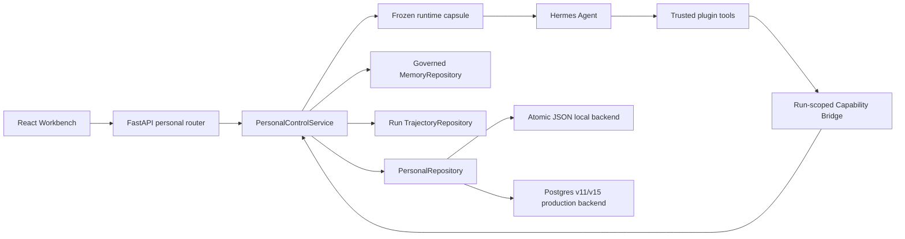

# HermesGraph Personal Control Plane

最后更新：2026-08-02
状态：后端、Hermes 工具、可直接使用的个人事务工作台与离线验证已完成

## 1. 目标与边界

Personal Control Plane 将个人 Agent 的长期组织状态从聊天记录和 Prompt 中拆出，形成一套
有作用域、有版本、有事件历史的结构化能力。它覆盖：

1. `Task / Plan / PlanStep / ChecklistItem / Note`
2. `Persona / Onboarding`
3. `DayArchive / Diary / Calendar`
4. 自然语言 Memory 更正与遗忘
5. 确定性 Emotion 状态与临时覆盖
6. 由 Task `due_at` 投影的本地到期提醒

这些能力属于个人 Agent 产品层，不修改已冻结的 Agentic RAG 检索策略。Hermes 仍是唯一在线
Agent Loop；LangChain 仍只负责 Integration Runtime；个人控制平面不创建第二个 Agent。

## 2. 已实现架构

核心实现：

- `app/personal/models.py`：严格领域合同与状态枚举。
- `app/personal/service.py`：所有业务规则、状态归约和 Hermes tool dispatch。
- `app/personal/repository.py`：repository protocol、JSON 原子实现、乐观并发。
- `app/personal/postgres.py`：Postgres migration v11/v15、记录表、append-only 事件表与提醒状态类型。
- `app/api/personal_router.py`：项目作用域 API。
- `app/agent/context_engine.py`：每次 run start 在统一 token 预算内冻结 personal context。
- `app/agent/hermes_bridge.py`：personal tool 预算、scope 与审计边界。
- `deploy/hermes/plugin/__init__.py`：Hermes strict tool schemas。

## 3. 数据合同

所有记录都带 `tenant_id / project_id / user_id / version / created_at / updated_at`。写入使用
`expected_version` 做 compare-and-swap；并发旧版本写入返回冲突，不静默覆盖。

| 记录 | 核心字段 | 生命周期 |
| --- | --- | --- |
| Task | title、description、priority、due、tags | inbox → planned/in_progress/blocked → completed/archived |
| Plan | task_id、objective、target_date | draft → active/paused → completed/archived |
| PlanStep | plan_id、position、detail、due | todo → in_progress → completed/skipped |
| ChecklistItem | task_id xor step_id、label、checked | open ↔ checked |
| Note | kind、task_id/plan_id/date、title、content | create/update |
| PersonaProfile | 称呼、Agent 名、风格、语气、语言、时区、兴趣、边界 | new → onboarding complete，可重置 |
| DayArchive | date、summary、diary、highlights、decisions、open_loops | deterministic seal → user edit/force reseal |
| EmotionOverride | state、note、expires_at | active → expired/cleared |
| TaskReminderState | task_id、due_at、kind、read_at、snoozed_until | 当前提醒阶段的交互状态；任务改期/阶段变化自动失效 |

Postgres v11 使用通用 `personal_records` JSONB 表承载当前快照，使用 `personal_events` 保存
append-only 变更历史。记录 key 对 persona、day archive 和 emotion override 提供作用域唯一约束；
parent/date/status 索引支持任务明细和月历读取。

提醒本身不是持久业务事实。`TaskReminderFeed` 每次从开放 Task、Persona timezone 和当前时间确定性
生成；Postgres v15 只允许通用记录表保存 `reminder_state`，用于已读和稍后提醒。状态同时绑定
`task_id + due_at + kind`，因此改期、由 today 进入 due-soon、再进入 overdue 都会重新产生未读提醒。

## 4. Hermes 工具

| Tool | 动作 | 写入原则 |
| --- | --- | --- |
| `manage_personal_tasks` | list/create/update/complete/archive + checklist | 只有明确用户意图才写 |
| `manage_personal_plans` | list/create/update/activate/pause/complete/archive/add_step/update_step | 复用已有计划，不重复创建 |
| `manage_personal_notes` | list/upsert | 保持 note 与 task/plan/date 关联 |
| `correct_personal_memory` | forget/replace | 多候选时必须确认 memory IDs |
| `manage_personal_profile` | get/update/set_emotion/clear_emotion | Persona/Emotion 写入必须来自明确用户意图 |
| `manage_personal_journal` | list/get/seal/update | seal 和编辑必须来自明确用户意图 |

六个工具统一经过：

- Bridge bearer authentication 和 run ID。
- 服务端绑定的 tenant/project/user scope。
- Pydantic validation 和 Hermes JSON schema。
- 全局 `MAX_TOOL_CALLS` 与独立 `MAX_PERSONAL_TOOL_CALLS`。
- `RunEventRecorder` 工具事件。
- 发布后禁止继续调用工具。

Hermes 原生 `todo` 可继续服务于单次推理过程；Personal Task 是用户可见、跨会话、可由 API/UI
管理的 durable 任务。两者不做隐式双写。

## 5. Persona 与运行时胶囊

首次读取 persona 会创建作用域默认配置；用户保存个人设置时完成 onboarding。每次 Hermes run
开始时，`ContextEngine` 冻结以下 bounded 状态：

- Persona 沟通偏好、兴趣与边界。
- 当前 emotion state 与 expression hint。
- 最多 8 个开放任务。
- 最多 3 个 active/paused 计划。

Persona 与 emotion 只能影响表达。胶囊和系统 Prompt 都明确禁止它们改变事实、证据要求、工具
权限、安全判断、任务优先级或当前用户指令。

## 6. Emotion Reducer

Emotion 不由模型自由生成，而由确定性 reducer 按固定优先级计算：

1. 未过期的用户 override。
2. 本地时间 23:00 至 06:00：`resting`。
3. 四小时内完成任务：`celebrating`。
4. 存在逾期开放任务：`supportive`。
5. 存在进行中任务：`focused`。
6. 二十分钟内有对话：`curious`。
7. 昨日已有归档：`reflective`。
8. 默认：`calm`。

每个 snapshot 包含 state、中文 label、valence、energy、expression hint、reason codes 和
`overridden`。用户 override 有 5 至 1440 分钟 TTL，可随时清除并恢复自动 reducer。

## 7. Day Archive

`seal_day(date)` 不依赖外部模型，可在无 API 模式运行。它在 persona timezone 中汇总：

- 当日 scoped run trajectories。
- 当日完成任务。
- 仍未完成的 open loops。
- 对话输入形成的 bounded highlights。
- 当日 daily Note 的标题与正文。
- seal 时的 emotion snapshot。

输出包含结构化 summary、第一人称 diary、highlights、decisions、open loops 和 run IDs。重复普通
seal 幂等返回现有归档；`force=true` 重新生成；用户编辑按 version 做乐观并发。

## 8. 自然语言 Memory 纠错

纠错入口使用确定性语法，不调用模型：

- 遗忘：`忘记关于 X 的记忆`、`please forget X`。
- 替换：`把 X 更正为 Y`、`不是 X，而是 Y`、`replace X with Y`。

执行规则：

1. 在当前 tenant/project/user 内检索 X。
2. 零匹配返回 `no_match`；无法识别意图返回 `invalid`。
3. 单匹配可以直接撤回。
4. 多匹配返回 `needs_confirmation` 和候选，必须携带确认 ID 重试。
5. Replace 撤回确认的旧记录，再创建 confidence 1.0、`USER_ASSERTED` provenance 的新
   Semantic Memory，并记录 correction_of 与 revoked IDs。

该流程保留旧记录的 revoked 状态和来源，不原地篡改历史。

## 9. API

统一前缀：`/v1/projects/{project_id}/personal`

- `/tasks`、`/tasks/{task_id}`
- `/reminders`、`/reminders/{task_id}/read`、`/reminders/read-all`、`/reminders/{task_id}/snooze`
- `/plans`、`/plans/{plan_id}`、`/plans/{plan_id}/steps`
- `/plan-steps/{step_id}`
- `/checklist`、`/checklist/{item_id}`
- `/notes`
- `/persona`
- `/days?date_from=&date_to=`、`/days/{date}`、`/days/{date}/seal`
- `/emotion`、`/emotion/override`
- `/memory-corrections`

当前公开 `/v1` 仍沿用本地单用户信任模型。Personal API 已做 project/user 数据作用域和版本冲突，
但统一终端用户身份认证仍是全项目级 P0，不能把 query `user_id` 当生产认证。

## 10. 工作台

- **聊天快速记录**：不经过模型直接创建任务、带 `due_at` 的日程任务或指定日期的 daily Note；保存后
  使用服务端返回的 record ID/日期跳转到对应工作区。
- **行动中心**：任务过滤/新建/完成/归档、任务 checklist、关联计划、计划状态、步骤完成、任务笔记。
- **通知中心**：逾期/即将到期/今日任务、未读角标、全部已读、延后 1 小时、精确任务跳转；60 秒轮询，
  浏览器系统通知只在用户显式授权后启用。
- **日历回顾**：月历、归档日期标记、到期任务数量、当天安排完成、daily Note 新建、选日生成、
  强制重生成、summary/diary/三类列表编辑。
- **个人设置**：onboarding、Persona 字段、自动 Emotion snapshot、手动状态与 TTL。
- **记忆库**：自然语言纠错、候选选择确认、成功后刷新记忆列表。

桌面布局使用信息密集的分栏，移动端切换为纵向布局；底部导航改为可横向滚动，避免新增入口挤压。
“日程”是带 `scheduled` 标签和 `due_at` 的 Personal Task，而不是独立 Event；这让行动状态、日历
聚合、运行时胶囊和日归档共享同一事实来源。

## 11. 验证与完成定义

已验证：

- 全套 332 项：315 passed、17 个环境型 skip。
- Personal vertical tests：领域链路、作用域隔离、乐观锁、Memory 歧义确认、API、Hermes budget。
- 真实浏览器在隔离本地后端完成日程创建、精确定位、当天完成、daily Note 创建和日归档；
  1280 x 720 与 390 x 844 均无横向溢出。
- Hermes plugin schema 与现有 Bridge tests。
- Strict mypy：163 个应用源码文件通过。
- Ruff：新增与修改源码通过。
- React/TypeScript production build 通过。
- Postgres contract 已加入 v11/v15 migration、scope、event history 测试；全局 migration version
  唯一/连续门禁不依赖数据库环境。生产 Compose 已实际应用 `15:personal_reminder_state`。
- 真实浏览器完成未读角标、标为已读、打开任务、延后 1 小时、改期后重新提醒和归档清理；
  1280 桌面与 390 x 844 移动端均无横向溢出，浏览器 console 无 error。

不包含：

- 外部日历/邮件同步。
- 任意本机文件写改删。
- 模型自由生成 Emotion。
- Task 与 Hermes native todo 的隐式同步。
- 应用关闭后的独立后台提醒调度、推送服务或外部日历同步。
